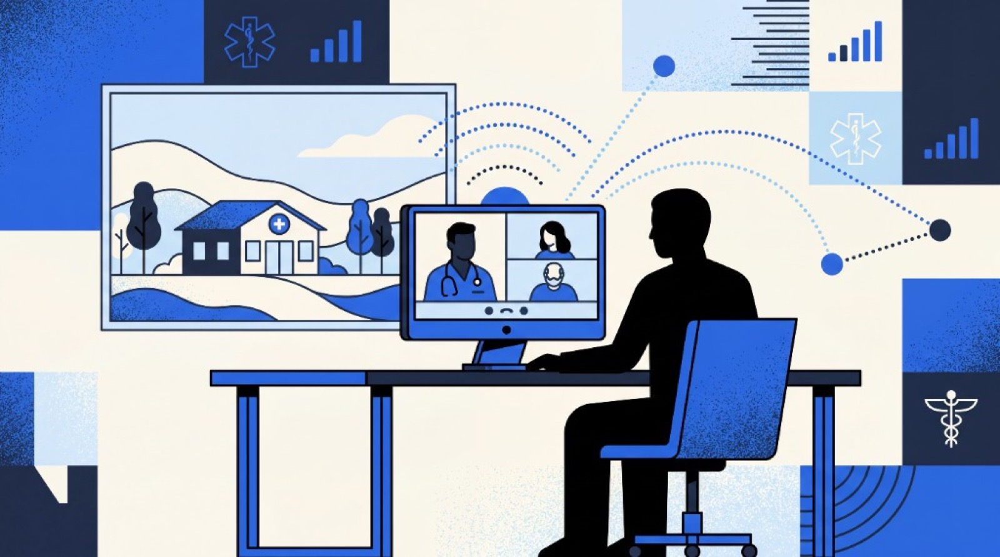

```{=html}
<div class="blog-shell">
  <div class="blog-article-grid">
    <div class="blog-prose-column">
      <a href="../media.html" class="article-back-link">
        <svg width="16" height="16" viewBox="0 0 24 24" fill="none" stroke="currentColor" stroke-width="2"><line x1="19" y1="12" x2="5" y2="12"/><polyline points="12 19 5 12 12 5"/></svg>
        Back to Blogs &amp; Media
      </a>

      <header class="mb-8">
        <div class="article-tags">
          <span class="article-tag-pill">rural health</span> <span class="article-tag-pill">technology</span> <span class="article-tag-pill">telehealth</span> <span class="article-tag-pill">digital health</span>
        </div>
        <div class="article-kicker">Media</div>
        <h1 class="article-h1">Bridging the Gap: Rural Health Needs Technology Tools, Too</h1>
        

        <div class="article-byline">
          <div class="byline-authors">
            <span class="author-chip"> <span>Ahmed Qureshi</span></span>
          </div>
          <span class="byline-dot">&middot;</span>
          <span class="byline-date">June 15, 2024</span>

          <div class="article-share-actions">
            <a href="https://www.linkedin.com/sharing/share-offsite/?url=" target="_blank" rel="noopener noreferrer" class="share-btn" aria-label="Share on LinkedIn">
              <svg width="15" height="15" viewBox="0 0 24 24" fill="currentColor"><path d="M19 0h-14c-2.761 0-5 2.239-5 5v14c0 2.761 2.239 5 5 5h14c2.762 0 5-2.239 5-5v-14c0-2.761-2.238-5-5-5zm-11 19h-3v-11h3v11zm-1.5-12.268c-.966 0-1.75-.79-1.75-1.764s.784-1.764 1.75-1.764 1.75.79 1.75 1.764-.783 1.764-1.75 1.764zm13.5 12.268h-3v-5.604c0-3.368-4-3.113-4 0v5.604h-3v-11h3v1.765c1.396-2.586 7-2.777 7 2.476v6.759z"/></svg>
            </a>
            <a href="https://twitter.com/intent/tweet" target="_blank" rel="noopener noreferrer" class="share-btn" aria-label="Share on X">
              <svg width="14" height="14" viewBox="0 0 24 24" fill="currentColor"><path d="M18.244 2.25h3.308l-7.227 8.26 8.502 11.24H16.17l-5.214-6.817L4.99 21.75H1.68l7.73-8.835L1.254 2.25H8.08l4.713 6.231zm-1.161 17.52h1.833L7.084 4.126H5.117z"/></svg>
            </a>
            
          </div>
        </div>
      </header>

      

      <div class="article-body">
```


In the sprawling landscapes of rural America, accessing quality healthcare can feel like traversing a vast expanse with few guiding lights. While much attention has been rightfully placed on addressing the shortage of healthcare providers in these regions, there's another critical aspect that often goes overlooked: the need for tailored technology solutions — the same coordination challenge hospitals now face under [CMS TEAM](/cms-team/) episode accountability.

<aside class="blog-tldr not-prose"><div class="blog-tldr__label">TL;DR</div><div class="blog-tldr__body">
- Rural provider shortages need more than telehealth alone
- Holistic digital networks connect patients, providers, and payors
- Interoperability beats siloed point solutions
- Hospitals and payors gain efficiency when care stays upstream
- [Prepare for TEAM](/cms-team/) with coordinated post-acute pathways
</div></aside>

As I delve into the complexities of rural healthcare and the potential of technology to transform it, I cannot help but reflect on my personal connection to these issues and growing up in a family with a longstanding connection to making healthcare more accessible. My mother is still a practicing physician in rural Arkansas and before that my grandmother served as one of the first female physicians in the country of Pakistan. I've witnessed firsthand the challenges faced by residents in accessing quality healthcare in underserved communities.

These experiences have not only shaped my understanding of the disparities that exist but have also fueled my passion for driving meaningful change. Having lived in medically underserved communities, I've experienced the resilience and resourcefulness of residents who navigate a healthcare system fraught with challenges. But it also comes with an appreciation for having a culturally aware and innovative approach that leverages technology to amplify impact.

## The Rural Healthcare Dilemma: Provider Shortages and Critical Gaps

Rural communities across the country face a daunting challenge: a severe shortage of healthcare providers. Physicians, nurses, and specialists are in short supply, leaving a large population with limited access to essential healthcare services within the community. Coupled with geographic barriers and socioeconomic disparities, this shortage exacerbates health inequities and compromises patient outcomes. The silos in healthcare rear their head again, the artificially created shortages compound throughout the entire healthcare landscape and its effects are felt even in larger urban areas.

While telehealth tools have emerged as a new tool for rural communities, offering virtual consultations and remote patient monitoring, they represent only a partial solution to the larger problem. While telehealth bridges the gap in provider accessibility to some extent, it falls short in addressing the comprehensive healthcare needs of rural residents. There are time constraints, urgency of need, and limitations to what can be accomplished only virtually.

## Moving Beyond Telehealth: Towards a Holistic Digital Provider Network

To truly address the multifaceted challenges of rural healthcare, we need to expand beyond the confines of traditional telehealth solutions. Instead, we must envision a digital provider network that extends beyond the boundaries of physical healthcare facilities and embraces patients where they are. This network should encompass a blend of public, private, and community-focused initiatives, working in synergy to deliver wraparound care to rural populations.

Healthcare infrastructure is incredibly powerful and complex however it still falls short of the complete complexity of need from a single patient. In following patients not to a single point of care but rather through their full care event to a longitudinal lens of their care over time, we can foresee challenges and patterns. Single patients and patient populations become easier to navigate to needs of care when they are seen through a holistic lens with the learnings shared through all stakeholders from patients to payors.

## Integrating Digital Health Tools: Breaking Down Silos for Seamless Care

While digital health tools have the potential to improve connectivity and access to care, they also risk creating silos within the healthcare ecosystem. To maximize their impact, it's essential to prioritize integrations that facilitate seamless communication and data sharing among providers, payors, and patients. By breaking down silos and fostering interoperability, we can ensure that rural residents receive coordinated, holistic care that addresses their unique needs in one, easy to use location.

By bringing the operational and clinical expertise that is required to serve patients on every level of acuity and across clinical needs together, data can be shared more openly for clinical decision making as well as logistics management.

## Benefits for Hospitals, Payors, and Patients alike!

The benefits of embracing a digital provider network extend beyond improved patient outcomes. Hospitals and payors stand to gain from reduced overhead costs, increased efficiency, and enhanced patient satisfaction. With patients having better access to a cohesive care team that meets their specific needs, they will have a more proactive approach to their care, empowering them to manage their healthcare more upstream and help avoid exacerbations of chronic conditions that may necessitate hospitalization. By leveraging technology to streamline workflows, optimize resource allocation, and empower patients to take an active role in their healthcare journey, stakeholders can create a sustainable healthcare ecosystem that benefits all.

## Looking Ahead: The Promise of Technology Built for Rural Regions

As we look to the future, there's immense potential for technology specifically tailored to the needs of rural regions. From remote monitoring devices and mobile health apps to AI-powered diagnostics and predictive analytics, innovations abound that have the power to transform rural healthcare delivery. By investing in research, development, and implementation of these technologies, we can unlock new possibilities for expanding access, improving outcomes, and narrowing health disparities in rural America.

In conclusion, bridging the gap in rural healthcare requires more than just increasing the number of providers; it demands a holistic approach that leverages technology to create connected networks of care. By embracing innovation, fostering collaboration, and prioritizing the needs of rural communities, we can build a future where quality healthcare is accessible to all, regardless of geographic location.

**Further reading:** [What Is the CMS TEAM Model?](/cms-team/) · [TEAM FAQ](/about/faq/) · [R.A.I.N. Compliant™](/team/)


```{=html}
      </div>
    </div>

    <!-- Sticky Right Featured Sidebar (Screenshots 2-4) -->
    <aside class="blog-featured not-prose" aria-labelledby="blog-featured-heading">
      <h2 id="blog-featured-heading" class="blog-featured__heading">Featured</h2>
      <ul class="blog-featured__list">
        
              <li>
                <a href="the-trust-gap-health-data-governance-cora-han.html" class="blog-featured__link">
                  
                  <span class="blog-featured__title">The Trust Gap: Cora Han on Health Data Governance, Responsible AI, and Care Transitions</span>
                </a>
              </li>
            

              <li>
                <a href="cms-team-safety-net-hospitals-sandra-scott.html" class="blog-featured__link">
                  
                  <span class="blog-featured__title">How Is the CMS TEAM Model Reshaping Leadership at Safety Net Hospitals?</span>
                </a>
              </li>
            

              <li>
                <a href="hip-fracture-home-scott-cooper.html" class="blog-featured__link">
                  
                  <span class="blog-featured__title">Patients Do Better at Home: Dr. Scott Cooper on Hip Fractures, TEAM, and the 90-Day Episode</span>
                </a>
              </li>
            

              <li>
                <a href="rainfall-health-adds-three-new-rain-compliant-partners.html" class="blog-featured__link">
                  
                  <span class="blog-featured__title">Rainfall Health Adds Three New Partners to its Verified Ecosystem to Help Hospitals Meet Federal CMS Mandates</span>
                </a>
              </li>
            

              <li>
                <a href="bundled-payment-analytics-steve-schutzer.html" class="blog-featured__link">
                  
                  <span class="blog-featured__title">Physician-Led Bundled Payments Work: Dr. Steve Schutzer on 20 Years of Joint Replacement Data</span>
                </a>
              </li>
            

              <li>
                <a href="ai-leverage-mark-adams-two-bear-capital.html" class="blog-featured__link">
                  
                  <span class="blog-featured__title">AI Won't Replace Nurses — It Will Give Them Leverage: Mark Adams on the Future of Healthcare AI</span>
                </a>
              </li>
            
      </ul>
    </aside>
  </div>
</div>
```
