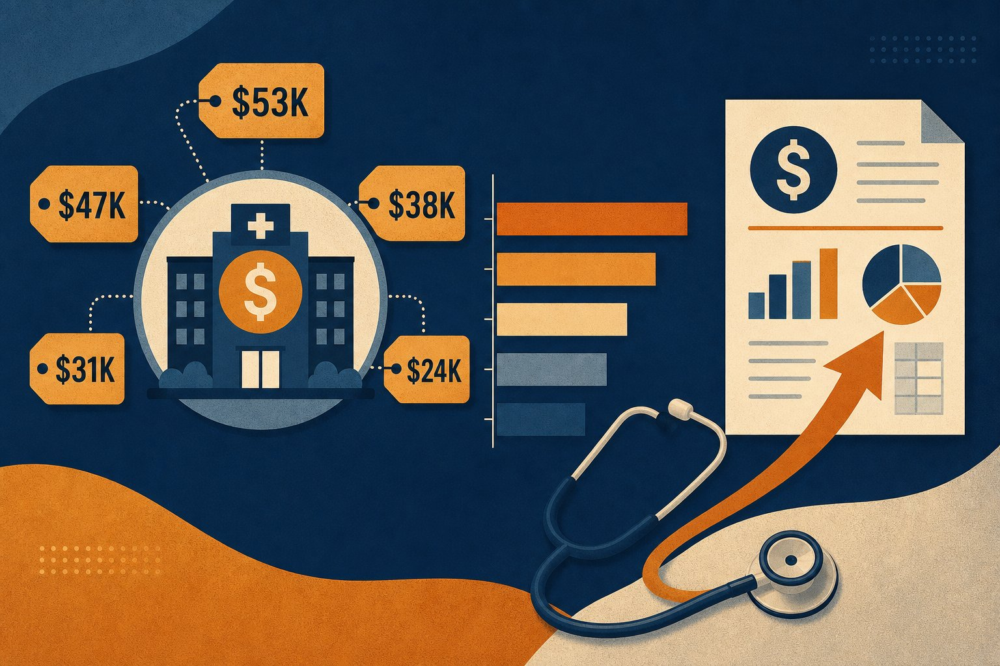
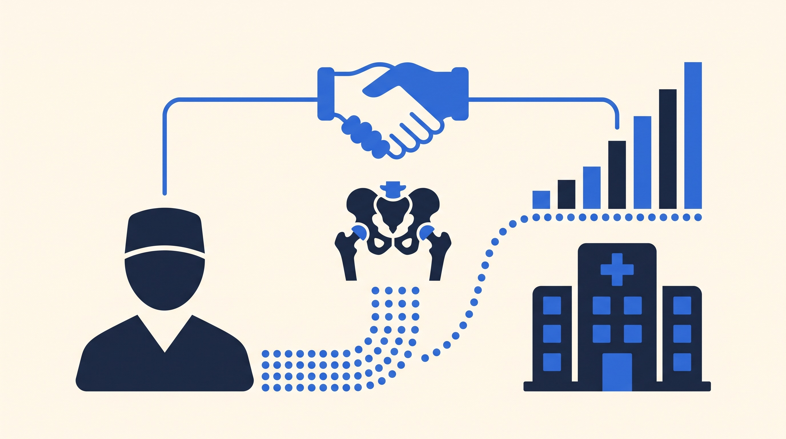

```{=html}
<div class="blog-shell">
  <div class="blog-article-grid">
    <div class="blog-prose-column">
      <a href="../media.html" class="article-back-link">
        <svg width="16" height="16" viewBox="0 0 24 24" fill="none" stroke="currentColor" stroke-width="2"><line x1="19" y1="12" x2="5" y2="12"/><polyline points="12 19 5 12 12 5"/></svg>
        Back to Blogs &amp; Media
      </a>

      <header class="mb-8">
        <div class="article-tags">
          <span class="article-tag-pill">CMS TEAM</span> <span class="article-tag-pill">Medicare Reimbursement</span> <span class="article-tag-pill">Episode Cost</span> <span class="article-tag-pill">Financial Risk</span> <span class="article-tag-pill">sandbox-blog</span>
        </div>
        <div class="article-kicker">Media</div>
        <h1 class="article-h1">What a CMS TEAM Episode Actually Costs: $24K to $53K Depending on Procedure</h1>
        <p class="article-subtitle" style="font-size:1.15rem; color:#475569; margin-bottom:1.5rem; line-height:1.6;">The financial math behind CMS TEAM target prices, discount factors, and stop-loss limits — what each procedure type costs on average and how those costs translate to hospital risk.</p>

        <div class="article-byline">
          <div class="byline-authors">
            <span class="author-chip"> <span>Jennifer Tim-Diamond</span></span>
          </div>
          <span class="byline-dot">&middot;</span>
          <span class="byline-date">July 22, 2026</span>

          <div class="article-share-actions">
            <a href="https://www.linkedin.com/sharing/share-offsite/?url=" target="_blank" rel="noopener noreferrer" class="share-btn" aria-label="Share on LinkedIn">
              <svg width="15" height="15" viewBox="0 0 24 24" fill="currentColor"><path d="M19 0h-14c-2.761 0-5 2.239-5 5v14c0 2.761 2.239 5 5 5h14c2.762 0 5-2.239 5-5v-14c0-2.761-2.238-5-5-5zm-11 19h-3v-11h3v11zm-1.5-12.268c-.966 0-1.75-.79-1.75-1.764s.784-1.764 1.75-1.764 1.75.79 1.75 1.764-.783 1.764-1.75 1.764zm13.5 12.268h-3v-5.604c0-3.368-4-3.113-4 0v5.604h-3v-11h3v1.765c1.396-2.586 7-2.777 7 2.476v6.759z"/></svg>
            </a>
            <a href="https://twitter.com/intent/tweet" target="_blank" rel="noopener noreferrer" class="share-btn" aria-label="Share on X">
              <svg width="14" height="14" viewBox="0 0 24 24" fill="currentColor"><path d="M18.244 2.25h3.308l-7.227 8.26 8.502 11.24H16.17l-5.214-6.817L4.99 21.75H1.68l7.73-8.835L1.254 2.25H8.08l4.713 6.231zm-1.161 17.52h1.833L7.084 4.126H5.117z"/></svg>
            </a>
            
          </div>
        </div>
      </header>

      

      <div class="article-body">
```


<aside class="blog-tldr not-prose"><div class="blog-tldr__label">TL;DR</div><div class="blog-tldr__body">
- Targets use historical baselines
- CMS applies a discount factor
- Post-acute spend drives variance
- High-cost episodes need redesign
</div></aside>

When CMS designed TEAM, it built the financial incentives around a simple premise: hospitals that manage the total cost of a surgical episode more efficiently than their historical baseline will be rewarded, and those that don't will eventually be penalized. Understanding what that means in dollar terms requires understanding three numbers for each procedure type: the average episode cost, the discount factor, and the stop-loss limit.

<BlogChartFigure src={"/charts/team-episode-cost.png"} alt={"Stacked bar chart showing average CMS TEAM episode cost by procedure including anchor and post-discharge components"} caption={"CABG and spinal fusion episodes average more than twice the cost of a hip or knee replacement — but LEJR’s volume (118,000+ annually) makes it the primary driver of aggregate TEAM financial exposure. The blue segment shows how much of each episode falls in the post-discharge window, where hospitals now bear financial responsibility."} source={"CMS IPPS FY2025 Final Rule preamble (89 FR 68986), Table X.A.3.a. Rainfall Health."} />

## How CMS sets the target price

Each hospital's target price is derived from its own historical episode spending, blended with regional and national benchmarks. CMS then applies a **discount factor** — a fixed percentage reduction that represents the program's expected savings to Medicare. For LEJR, spinal fusion, and SHFFT, that discount is **2.0%**. For CABG and major bowel procedures, it is **1.5%**.

This means a hospital with a $24,540 historical LEJR episode cost faces a target price of approximately **$24,049** — the difference ($491 per episode) that CMS retains as program savings. To earn a gain payment, the hospital must bring actual episode spending *below* that already-discounted target.

A Composite Quality Score (CQS) then adjusts reconciliation amounts upward or downward based on performance on readmissions, complications, and patient experience metrics. A strong CQS amplifies gains; a weak one reduces them.

<BlogChartFigure src={"/charts/team-episode-revenue.png"} alt={"Grouped bar chart showing average TEAM gain and loss per episode by procedure type"} caption={"Every navy bar is an opportunity; every amber bar is a risk. The asymmetry matters: CABG losses average $15,142 per over-target episode — more than double the average LEJR loss. A hospital with 20 annual CABG episodes that runs them all over target faces $303,000 in CABG-alone losses in PY2."} source={"Institute for Accountable Care / ACS analysis, CMS IPPS FY2025 data (2023). Rainfall Health."} />

## The five procedures: where the money concentrates

**LEJR** ($24,540 average) is the volume leader and the primary TEAM opportunity for most hospitals. The lower per-episode cost means smaller gain/loss per case, but LEJR's 118,000 annual episodes (58% of total TEAM volume) make aggregate outcomes significant. Hospitals that can shift even 200 LEJR episodes from over-target to under-target stand to capture $400,000–$1.5M in annual gains.

**Spinal fusion** ($51,237 average) carries the second-highest average episode cost and the largest absolute gain potential per favorable episode ($7,833). Post-discharge spending accounts for 27% of the average episode cost — meaning discharge planning and post-acute coordination are the key levers.

**SHFFT** ($46,615 average) is the most complex episode type to manage because patients are largely unplanned admissions. Post-discharge spending runs 63% of the average episode cost — the highest post-discharge ratio of any TEAM procedure. This is where home health and SNF partnerships pay off most directly.

**Major bowel** ($35,553 average) involves a heterogeneous patient mix. The 37% post-discharge cost share is significant, and the variety of diagnoses (elective colorectal, emergency resection) complicates standardized care pathways.

**CABG** ($52,934 average) has the highest per-episode cost but the lowest post-discharge ratio (22%). The anchor hospitalization itself — ICU days, perfusion, surgical complexity — drives most of the cost. Over-target CABG episodes average a $15,142 loss, the highest average loss of the five procedure types.

## Stop-gain, stop-loss, and the PY1 safety net

CMS limits how much any hospital can gain or lose in a single performance year through stop-gain and stop-loss caps. In Track 1 (the default for PY1), there is a **10% stop-gain** and **no downside risk**. Track 3 raises the ceiling to **20% stop-gain** with a **20% stop-loss**.

In practical terms, for a hospital with a $24,540 LEJR target price, the Track 3 stop-gain cap means the maximum gain per episode is approximately **$4,908**. The stop-loss cap means the maximum penalty per episode is also approximately **$4,908**. Across hundreds of episodes, these caps can represent millions of dollars in bounded exposure.

Performance Year 1 (calendar year 2026) carries no downside risk for most participants. That changes in PY2. Hospitals that have not yet built the episode management infrastructure — baseline cost reporting, post-acute partnerships, real-time claim attribution — face two-sided risk without the tools to respond to it.

## Frequently asked questions

### What is the average CMS TEAM episode cost?

Average episode costs range from $24,540 for LEJR (hip/knee replacement) to $52,934 for CABG (coronary artery bypass graft), based on 2021 baseline data from the CMS IPPS FY2025 Final Rule.

### What is the TEAM discount factor?

CMS applies a 2.0% discount factor to LEJR, spinal fusion, and SHFFT target prices, and a 1.5% factor to CABG and major bowel. This discount represents CMS's expected savings from the program.

### When does TEAM downside risk begin?

Performance Year 1 (2026) has no downside risk for Track 1 participants. Track 2 and Track 3 introduce downside risk starting in PY2 (2027), with stop-loss limits of 5% and 20% respectively.

### What is the maximum gain per LEJR episode under Track 3?

Under Track 3's 20% stop-gain cap, the maximum gain per LEJR episode is approximately $4,908 (20% of the ~$24,540 average target price). Actual amounts vary by hospital-specific targets.

<BlogReferences items={[{"id":1,"text":"CMS, FY2025 IPPS Final Rule, Section X.A.3 — TEAM episode baseline costs and target price methodology, 89 FR 68986.","url":"https://www.federalregister.gov/documents/2024/08/28/2024-17021/medicare-program-hospital-inpatient-prospective-payment-systems"},{"id":2,"text":"Institute for Accountable Care / ACS, TEAM episode gain/loss analysis, 2024.","url":"https://www.facs.org/advocacy/transforming-episode-accountability-model/"},{"id":3,"text":"CMS, \"Transforming Episode Accountability Model (TEAM),\" model overview.","url":"https://www.cms.gov/priorities/innovation/innovation-models/team-model"},{"id":4,"text":"HFMA, \"Hospitals can use 2026 to prepare for CMS TEAM bundled payment risk,\" March 2026.","url":"https://www.hfma.org/payment-reimbursement-and-managed-care/hospitals-can-use-2026-to-prepare-for-cms-team-bundled-payment-risk"}]} />

```{=html}
      </div>
    </div>

    <!-- Sticky Right Featured Sidebar (Screenshots 2-4) -->
    <aside class="blog-featured not-prose" aria-labelledby="blog-featured-heading">
      <h2 id="blog-featured-heading" class="blog-featured__heading">Featured</h2>
      <ul class="blog-featured__list">
        
              <li>
                <a href="the-trust-gap-health-data-governance-cora-han.html" class="blog-featured__link">
                  
                  <span class="blog-featured__title">The Trust Gap: Cora Han on Health Data Governance, Responsible AI, and Care Transitions</span>
                </a>
              </li>
            

              <li>
                <a href="cms-team-safety-net-hospitals-sandra-scott.html" class="blog-featured__link">
                  
                  <span class="blog-featured__title">How Is the CMS TEAM Model Reshaping Leadership at Safety Net Hospitals?</span>
                </a>
              </li>
            

              <li>
                <a href="hip-fracture-home-scott-cooper.html" class="blog-featured__link">
                  
                  <span class="blog-featured__title">Patients Do Better at Home: Dr. Scott Cooper on Hip Fractures, TEAM, and the 90-Day Episode</span>
                </a>
              </li>
            

              <li>
                <a href="rainfall-health-adds-three-new-rain-compliant-partners.html" class="blog-featured__link">
                  
                  <span class="blog-featured__title">Rainfall Health Adds Three New Partners to its Verified Ecosystem to Help Hospitals Meet Federal CMS Mandates</span>
                </a>
              </li>
            

              <li>
                <a href="bundled-payment-analytics-steve-schutzer.html" class="blog-featured__link">
                  
                  <span class="blog-featured__title">Physician-Led Bundled Payments Work: Dr. Steve Schutzer on 20 Years of Joint Replacement Data</span>
                </a>
              </li>
            

              <li>
                <a href="ai-leverage-mark-adams-two-bear-capital.html" class="blog-featured__link">
                  
                  <span class="blog-featured__title">AI Won't Replace Nurses — It Will Give Them Leverage: Mark Adams on the Future of Healthcare AI</span>
                </a>
              </li>
            
      </ul>
    </aside>
  </div>
</div>
```
