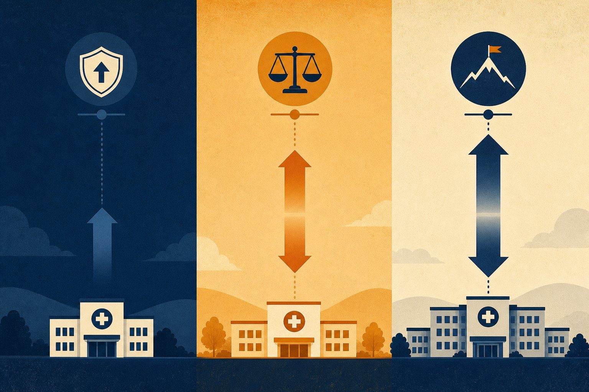

```{=html}
<div class="blog-shell">
  <div class="blog-article-grid">
    <div class="blog-prose-column">
      <a href="../media.html" class="article-back-link">
        <svg width="16" height="16" viewBox="0 0 24 24" fill="none" stroke="currentColor" stroke-width="2"><line x1="19" y1="12" x2="5" y2="12"/><polyline points="12 19 5 12 12 5"/></svg>
        Back to Blogs &amp; Media
      </a>

      <header class="mb-8">
        <div class="article-tags">
          <span class="article-tag-pill">CMS TEAM</span> <span class="article-tag-pill">TEAM Tracks</span> <span class="article-tag-pill">Bundled Payments</span> <span class="article-tag-pill">Hospital Compliance</span> <span class="article-tag-pill">sandbox-blog</span>
        </div>
        <div class="article-kicker">Media</div>
        <h1 class="article-h1">CMS TEAM Track 1 vs. Track 2 vs. Track 3: Which Is Right for Your Hospital?</h1>
        <p class="article-subtitle" style="font-size:1.15rem; color:#475569; margin-bottom:1.5rem; line-height:1.6;">A complete comparison of the three CMS TEAM participation tracks — risk levels, stop-gain/stop-loss limits, eligibility criteria, and how to decide which track your hospital should be in.</p>

        <div class="article-byline">
          <div class="byline-authors">
            <span class="author-chip"> <span>Jennifer Tim-Diamond</span></span>
          </div>
          <span class="byline-dot">&middot;</span>
          <span class="byline-date">July 22, 2026</span>

          <div class="article-share-actions">
            <a href="https://www.linkedin.com/sharing/share-offsite/?url=" target="_blank" rel="noopener noreferrer" class="share-btn" aria-label="Share on LinkedIn">
              <svg width="15" height="15" viewBox="0 0 24 24" fill="currentColor"><path d="M19 0h-14c-2.761 0-5 2.239-5 5v14c0 2.761 2.239 5 5 5h14c2.762 0 5-2.239 5-5v-14c0-2.761-2.238-5-5-5zm-11 19h-3v-11h3v11zm-1.5-12.268c-.966 0-1.75-.79-1.75-1.764s.784-1.764 1.75-1.764 1.75.79 1.75 1.764-.783 1.764-1.75 1.764zm13.5 12.268h-3v-5.604c0-3.368-4-3.113-4 0v5.604h-3v-11h3v1.765c1.396-2.586 7-2.777 7 2.476v6.759z"/></svg>
            </a>
            <a href="https://twitter.com/intent/tweet" target="_blank" rel="noopener noreferrer" class="share-btn" aria-label="Share on X">
              <svg width="14" height="14" viewBox="0 0 24 24" fill="currentColor"><path d="M18.244 2.25h3.308l-7.227 8.26 8.502 11.24H16.17l-5.214-6.817L4.99 21.75H1.68l7.73-8.835L1.254 2.25H8.08l4.713 6.231zm-1.161 17.52h1.833L7.084 4.126H5.117z"/></svg>
            </a>
            
          </div>
        </div>
      </header>

      

      <div class="article-body">
```


<aside class="blog-tldr not-prose"><div class="blog-tldr__label">TL;DR</div><div class="blog-tldr__body">
- Track 1 is upside-only
- Track 2 adds two-sided risk
- Track 3 is full downside risk
- Caps differ by track choice
</div></aside>

<BlogChartFigure src={"/charts/team-tracks.png"} alt={"Diverging bar chart comparing CMS TEAM Track 1, 2, and 3 stop-gain and stop-loss limits"} caption={"Track 1 in 2026 is the safe harbor: gain up to 10%, lose nothing. Track 3 starting in 2027 is where most hospitals will live — and where the full stakes of TEAM become real. The symmetry of Track 3 is the point: the same 20% that defines your upside also defines your downside."} source={"CMS FY2025 IPPS Final Rule (89 FR 68986), Section X. Rainfall Health."} />

## The three tracks at a glance

<div class="blog-table-scroll not-prose">

| Feature | Track 1 | Track 2 | Track 3 |
| --- | --- | --- | --- |
| Downside risk | None | 5% stop-loss | 20% stop-loss |
| Upside limit | 10% stop-gain | 5% stop-gain | 20% stop-gain |
| Performance years | PY1 (all); PY2-5 (limited eligibility) | PY2-5 (limited eligibility) | PY2-5 (all others) |
| Who qualifies | All hospitals in PY1 | Safety-net, rural, MDH, SCH, EACH | Most hospitals in PY2+ |
| Risk philosophy | Learning year — no penalty | Lower ceiling and floor | Full accountability |

</div>

## Track 1: the 2026 default

Every TEAM-mandated hospital begins in Track 1 for Performance Year 1 (calendar year 2026). Track 1 carries no downside financial risk: if aggregate episode spending exceeds target prices, the hospital owes nothing. The stop-gain cap is 10% — the maximum bonus payment per episode is 10% of the target price.

Track 1 is CMS's deliberate "dress rehearsal" year. The intent is for hospitals to benchmark their episode spending, build post-acute coordination infrastructure, and understand their target prices before real financial risk arrives. The practical implication: using Track 1 as a passive monitoring year rather than an active preparation year is a strategic mistake.

## Track 2: the safety-net alternative

Track 2 is available in Performance Years 2 through 5 only for specific hospital types: **safety-net hospitals, rural hospitals, Medicare-dependent hospitals (MDH), sole community hospitals (SCH), and essential access community hospitals (EACH)**. It offers symmetric 5% stop-gain and stop-loss limits — lower upside and lower downside than Track 3.

Track 2 is not a permanently lower-risk option for all hospitals. Most TEAM participants will not qualify for Track 2 and will transition directly to Track 3 in PY2. CFOs and compliance leaders at safety-net and rural hospitals should confirm their eligibility before the PY2 election window.

## Track 3: where most hospitals end up

Track 3 applies to all TEAM hospitals that do not qualify for Track 2 starting in Performance Year 2 (2027). It carries full two-sided financial risk: a **20% stop-gain** ceiling and a **20% stop-loss** floor. For a hospital with an average LEJR target price of $24,540, the maximum per-episode gain or loss under Track 3 is approximately $4,908.

Across a hospital performing 300 LEJR episodes per year, the theoretical maximum annual loss from LEJR alone is approximately $1.47 million (300 × $4,908). In practice, individual episodes vary, but the aggregate exposure is real. Optum Advisory estimated in 2025 that the average projected TEAM loss for underperforming hospitals is $1.2 million per facility annually.

## How to decide which track is right for your hospital

Most hospitals do not choose their track — they are assigned to Track 1 in PY1 and then move to the highest track they qualify for in PY2. The decision point is whether your hospital qualifies for Track 2 (safety-net or rural designation) and, if so, whether the lower ceiling makes financial sense given your current episode performance trajectory.

Hospitals that have completed benchmark analysis in PY1 and are on track for strong episode cost performance should generally prefer Track 3's higher upside ceiling. Hospitals with uncertain performance trajectories or limited infrastructure may prefer the Track 2 buffer — if they qualify.

## Frequently asked questions

### What is the difference between CMS TEAM Track 1, Track 2, and Track 3?

Track 1 is upside-only with a 10% stop-gain (PY1 default; no downside risk). Track 2 is limited two-sided risk at 5%/5% for eligible safety-net and rural hospitals in PY2-5. Track 3 is full two-sided risk at 20%/20% for most hospitals starting in PY2 (2027).

### Can hospitals choose their TEAM track?

All hospitals start in Track 1 for PY1. For PY2 and beyond, hospitals that qualify for Track 2 (safety-net, rural, MDH, SCH, EACH) may elect it; otherwise, they move to Track 3. Track elections occur through the CMS participant portal.

### What is the maximum penalty per episode under Track 3?

The stop-loss limit is 20% of the target price per episode. For an LEJR episode with a $24,540 target price, the maximum repayment is approximately $4,908 per over-target episode.

<BlogReferences items={[{"id":1,"text":"CMS, FY2025 IPPS Final Rule, Section X — TEAM Track definitions and eligibility, 89 FR 68986.","url":"https://www.federalregister.gov/documents/2024/08/28/2024-17021/medicare-program-hospital-inpatient-prospective-payment-systems"},{"id":2,"text":"CMS, \"Transforming Episode Accountability Model (TEAM),\" model overview.","url":"https://www.cms.gov/priorities/innovation/innovation-models/team-model"},{"id":3,"text":"HFMA, \"Hospitals can use 2026 to prepare for CMS TEAM bundled payment risk,\" March 2026.","url":"https://www.hfma.org/payment-reimbursement-and-managed-care/hospitals-can-use-2026-to-prepare-for-cms-team-bundled-payment-risk"}]} />

```{=html}
      </div>
    </div>

    <!-- Sticky Right Featured Sidebar (Screenshots 2-4) -->
    <aside class="blog-featured not-prose" aria-labelledby="blog-featured-heading">
      <h2 id="blog-featured-heading" class="blog-featured__heading">Featured</h2>
      <ul class="blog-featured__list">
        
              <li>
                <a href="the-trust-gap-health-data-governance-cora-han.html" class="blog-featured__link">
                  
                  <span class="blog-featured__title">The Trust Gap: Cora Han on Health Data Governance, Responsible AI, and Care Transitions</span>
                </a>
              </li>
            

              <li>
                <a href="cms-team-safety-net-hospitals-sandra-scott.html" class="blog-featured__link">
                  
                  <span class="blog-featured__title">How Is the CMS TEAM Model Reshaping Leadership at Safety Net Hospitals?</span>
                </a>
              </li>
            

              <li>
                <a href="hip-fracture-home-scott-cooper.html" class="blog-featured__link">
                  
                  <span class="blog-featured__title">Patients Do Better at Home: Dr. Scott Cooper on Hip Fractures, TEAM, and the 90-Day Episode</span>
                </a>
              </li>
            

              <li>
                <a href="rainfall-health-adds-three-new-rain-compliant-partners.html" class="blog-featured__link">
                  
                  <span class="blog-featured__title">Rainfall Health Adds Three New Partners to its Verified Ecosystem to Help Hospitals Meet Federal CMS Mandates</span>
                </a>
              </li>
            

              <li>
                <a href="bundled-payment-analytics-steve-schutzer.html" class="blog-featured__link">
                  
                  <span class="blog-featured__title">Physician-Led Bundled Payments Work: Dr. Steve Schutzer on 20 Years of Joint Replacement Data</span>
                </a>
              </li>
            

              <li>
                <a href="ai-leverage-mark-adams-two-bear-capital.html" class="blog-featured__link">
                  
                  <span class="blog-featured__title">AI Won't Replace Nurses — It Will Give Them Leverage: Mark Adams on the Future of Healthcare AI</span>
                </a>
              </li>
            
      </ul>
    </aside>
  </div>
</div>
```
