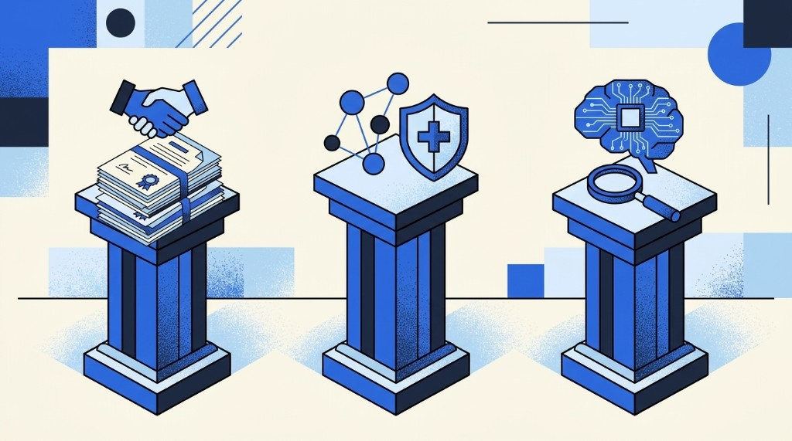

```{=html}
<div class="blog-shell">
  <div class="blog-article-grid">
    <div class="blog-prose-column">
      <a href="../media.html" class="article-back-link">
        <svg width="16" height="16" viewBox="0 0 24 24" fill="none" stroke="currentColor" stroke-width="2"><line x1="19" y1="12" x2="5" y2="12"/><polyline points="12 19 5 12 12 5"/></svg>
        Back to Blogs &amp; Media
      </a>

      <header class="mb-8">
        <div class="article-tags">
          <span class="article-tag-pill">CMS TEAM</span> <span class="article-tag-pill">hospital compliance</span> <span class="article-tag-pill">CMS TEAM compliance checklist</span> <span class="article-tag-pill">gain sharing</span> <span class="article-tag-pill">data governance</span> <span class="article-tag-pill">value-based care solutions</span> <span class="article-tag-pill">bundled payment analytics</span> <span class="article-tag-pill">AI governance</span> <span class="article-tag-pill">Rainfall Health Podcast</span>
        </div>
        <div class="article-kicker">Media</div>
        <h1 class="article-h1">The Compliance Risk Hiding in Plain Sight Under CMS TEAM</h1>
        

        <div class="article-byline">
          <div class="byline-authors">
            <span class="author-chip"> <span>Paul Uhrig</span></span> <span class="author-chip"> <span>Marla Merkle</span></span> <span class="author-chip"> <span>Robby Wallace</span></span>
          </div>
          <span class="byline-dot">&middot;</span>
          <span class="byline-date">August 05, 2026</span>

          <div class="article-share-actions">
            <a href="https://www.linkedin.com/sharing/share-offsite/?url=" target="_blank" rel="noopener noreferrer" class="share-btn" aria-label="Share on LinkedIn">
              <svg width="15" height="15" viewBox="0 0 24 24" fill="currentColor"><path d="M19 0h-14c-2.761 0-5 2.239-5 5v14c0 2.761 2.239 5 5 5h14c2.762 0 5-2.239 5-5v-14c0-2.761-2.238-5-5-5zm-11 19h-3v-11h3v11zm-1.5-12.268c-.966 0-1.75-.79-1.75-1.764s.784-1.764 1.75-1.764 1.75.79 1.75 1.764-.783 1.764-1.75 1.764zm13.5 12.268h-3v-5.604c0-3.368-4-3.113-4 0v5.604h-3v-11h3v1.765c1.396-2.586 7-2.777 7 2.476v6.759z"/></svg>
            </a>
            <a href="https://twitter.com/intent/tweet" target="_blank" rel="noopener noreferrer" class="share-btn" aria-label="Share on X">
              <svg width="14" height="14" viewBox="0 0 24 24" fill="currentColor"><path d="M18.244 2.25h3.308l-7.227 8.26 8.502 11.24H16.17l-5.214-6.817L4.99 21.75H1.68l7.73-8.835L1.254 2.25H8.08l4.713 6.231zm-1.161 17.52h1.833L7.084 4.126H5.117z"/></svg>
            </a>
            
            <a href="/downloads/eBook_compliance_risk_hiding_in_plain_sight_under_TEAM.pdf" class="btn-download-ebook" target="_blank" rel="noopener noreferrer">
              <svg width="14" height="14" viewBox="0 0 24 24" fill="none" stroke="currentColor" stroke-width="2"><path d="M21 15v4a2 2 0 0 1-2 2H5a2 2 0 0 1-2-2v-4"/><polyline points="7 10 12 15 17 10"/><line x1="12" y1="15" x2="12" y2="3"/></svg>
              <span>Download eBook</span>
            </a>
            
          </div>
        </div>
      </header>

      

      <div class="article-body">
```


<div class="my-4"><iframe width="100%" height="180" frameborder="no" scrolling="no" seamless src="https://share.transistor.fm/e/d434fe38"></iframe></div>

<aside class="blog-tldr not-prose"><div class="blog-tldr__label">TL;DR</div><div class="blog-tldr__body">
- Risk spans gainsharing, data, AI
- Document gain-sharing before care starts
- Late agreements fail compliance tests
- Limit vendor data use by purpose
- Centralize AI governance with oversight
- CMS enforces when thresholds are missed
</div></aside>

---

_Based on Rainfall Health Webinar Episode 4: CMS TEAM Compliance Risks Hiding in Plain Sight. Featuring Paul Uhrig, Senior Strategic Advisor at The Healthcare Trust Institute and former Chief Legal & Digital Health Officer at Bassett Healthcare Network, in conversation with Marla Merkle, VP of Compliance & Care Coordination, and Robby Wallace, VP of Clinical Implementation, Rainfall Health._

<div class="ratio ratio-16x9 my-4"><iframe src="https://www.youtube.com/embed/kr4R_XrG3ec" title="YouTube video player" frameborder="0" allow="accelerometer; autoplay; clipboard-write; encrypted-media; gyroscope; picture-in-picture" allowfullscreen style="width:100%; height:400px; border-radius:8px;"></iframe></div>

---

## Introduction: Underappreciated Compliance Exposure Under TEAM

CMS TEAM does not only change how hospitals get paid — it changes how legal, compliance, and clinical teams must document gain sharing, vendor data use, and AI tools across the 30-day episode. A practical **CMS TEAM compliance checklist** starts before the first case: written gain-sharing agreements, vendor data-use limits, and named AI oversight. Hospitals that treat compliance as a year-end exercise will miss the thresholds CMS already expects before care starts. For the program definition and hospital mandate, see our [CMS TEAM guide](/cms-team/).

The compliance risk hiding in plain sight is not a single statute. It is the intersection of three domains that rarely sit in one meeting: physician gain-sharing agreements written after the first cases have already run, vendor contracts that allow secondary use of episode data, and AI copilots deployed without a named governance owner.

Most public discussion of Medicare's Transforming Episode Accountability Model centers on episode definitions, risk tracks, and financial reconciliation. Less attention is paid to the compliance architecture beneath those mechanics: how hospitals structure gain sharing with downstream partners, how they govern data across organizational boundaries, and how they adopt artificial intelligence without introducing new regulatory exposure.

Paul Uhrig is Senior Strategic Advisor at The Healthcare Trust Institute and a member of Rainfall Health's R.A.I.N. Advisory Committee. He previously served as Chief Legal & Digital Health Officer at Bassett Healthcare Network and as Chief Administrative, Legal & Privacy Officer at Surescripts, and he sits on the boards of The Sequoia Project and the New York eHealth Collaborative. In conversation with Marla Merkle and Robby Wallace, he outlines the operational and legal questions hospitals should address early in TEAM implementation.

This article is informational and is not legal advice. It assumes familiarity with TEAM as a mandatory model for participating hospitals.

---

## Why Compliance Structures Matter Under TEAM

TEAM is designed to align incentives across the care continuum so that hospitals and downstream providers share accountability for outcomes after discharge. That alignment can improve care coordination — but it also creates compliance risk if the supporting legal, contractual, and data arrangements are incomplete or misaligned with operations.

> Legal and compliance teams really should be engaged early. The operationalization of these programs and the legal structure need to go hand in hand.
>
> — Paul Uhrig, Senior Strategic Advisor, The Healthcare Trust Institute

Uhrig recommends establishing a cross-functional committee — spanning technology, finance, legal, compliance, and population health — before implementation begins, so that legal and compliance leaders retain visibility into operational design.

Three domains organize the remainder of this discussion:

| Domain                         | Focus                                                                                                     |
| ------------------------------ | --------------------------------------------------------------------------------------------------------- |
| **Gain sharing and contracts** | Distributing incentive payments to downstream providers under appropriate criteria and written agreements |
| **Data governance**            | Sharing information across the continuum while limiting use to authorized purposes                        |
| **Artificial intelligence**    | Applying AI to episode analytics and post-discharge monitoring under centralized oversight                |

---

## Gain Sharing Requires More Than Shared Savings Language

Gain sharing is one mechanism for aligning incentives across the episode: when CMS pays an incentive for well-managed care, hospitals may share a portion with downstream partners who contributed to that performance. Structuring those arrangements correctly requires several interdependent elements.

| Component                  | Function                                                                                       |
| -------------------------- | ---------------------------------------------------------------------------------------------- |
| **Governance**             | Decision rights for establishing, monitoring, and adjusting arrangements                       |
| **Data analytics**         | Measurement that ties shared payments to documented performance                                |
| **Contracting**            | Written agreements with downstream providers, executed before care delivery or referrals begin |
| **Payment infrastructure** | Operational capacity to calculate and distribute episodic results accurately                   |

Legal documentation and operational practice must remain aligned. An agreement that does not reflect how care and payments actually flow is a compliance vulnerability, regardless of how carefully it is drafted.

Gain sharing also typically requires new financial relationships with ancillary providers and community network partners. Those discussions — including the criteria for sharing — should begin early.

---

## Five Questions for Legal Review Before Execution

Before a health system enters gain-sharing arrangements, legal counsel should examine at least five issues. Each corresponds to a recurring point of failure in similar programs.

1. **What is the regulatory authority?** Begin with Stark, the Anti-Kickback Statute, and the TEAM regulation — under both federal and applicable state law.
2. **What is the care-redesign objective?** Identify whether the arrangement is intended to advance efficiency, quality, care coordination, or some combination of those aims.
3. **How is compensation calculated?** Document the methodology and the process for recording how government incentive payments are shared.
4. **Could the arrangement be construed as rewarding referrals?** The exchange of value must support needed care; it must not induce referrals.
5. **Is the arrangement documented in writing before implementation?** Agreements should be in place before care begins and before patients are referred. Monitoring and auditing provisions should anticipate later government review.

---

## Fraud and Abuse Safeguards and the CMS-Sponsored Model Safe Harbor

> You can't have a perfect agreement if your operations are not aligned with what is supposed to happen. That coordination is where most missteps live.
>
> — Paul Uhrig

In late 2020 and early 2021, the Office of Inspector General issued a safe harbor for CMS-sponsored model arrangements. The framework remains relatively recent, and participating hospitals must comply strictly with its requirements. The arrangement must also advance the specific model in which the organization participates.

Core constraints include:

- The exchange of value must not be structured — or reasonably construed — to induce referrals
- Arrangements must not limit medically necessary services or encourage unnecessary services
- The purpose of the model remains appropriate care, not reduced access

A frequent error is treating written agreements as a retrospective exercise — documenting arrangements only after operations have begun. Downstream agreements should be executed before care delivery and before referral pathways are used.

---

## Data Governance Across the Episode Continuum

TEAM episodes span acute care, post-acute settings, and related services. Managing episode cost and quality therefore requires information exchange across organizations, and the applicable rules depend on the recipient.

**Provider-to-provider exchange** for treatment and health-care operations generally relies on established frameworks and infrastructure — including TEFCA, Epic Care Everywhere, and state health information exchanges — and is typically governed by HIPAA or applicable state privacy law. Health systems have substantial experience with these pathways.

**Vendor relationships** present greater complexity. When hospitals engage third parties for episode analytics or AI-enabled tools, they should maintain a HIPAA business associate agreement and tightly defined data-use restrictions. Episode analytics nearly always involve a vendor intermediary.

A recurring failure mode is use of data beyond the intended purpose — either because the vendor exceeds agreed limits, or because the contract itself authorizes broader uses than the health system intended.

> Scour that agreement to make sure there's no loophole that lets someone use data — identified or de-identified — in a way the health system never intended.
>
> — Paul Uhrig

### Vendor Diligence, Including Downstream Subcontractors

Risk often appears one layer removed: a vendor that relies on a subcontractor that was never adequately vetted. Hospitals should understand the systems in use and confirm that data use remains limited to the agreed purpose throughout the chain.

Providers also face a dual obligation:

| Withholding data                                          | Improper disclosure        |
| --------------------------------------------------------- | -------------------------- |
| May raise information-blocking concerns under federal law | May create HIPAA liability |

The operational task is to support appropriate patient care while remaining compliant on both sides of that balance.

---

## Artificial Intelligence Under TEAM: Governance First

TEAM requires analytics, and AI can help health systems understand post-discharge pathways and patient trajectories. Remote patient monitoring is also likely to expand in post-acute management, with many tools incorporating AI. The central question is not whether AI will be used, but how it will be governed.

**Centralize governance while involving clinical stakeholders.** Successful organizations establish system-level AI oversight while ensuring that relevant departments — for example, radiology or population health — participate in decisions that affect their workflows. Centralization reduces fragmented, siloed deployments.

**Maintain human oversight in early stages.** Reliability and accuracy should be verified deliberately. Continuous human review can limit efficiency gains, so systems must define where verification is required and where it can be reduced as confidence grows.

**Control training and secondary use of data.** Organizational data should not be used to train large language models unless that use is expressly authorized. As data mobility increases, contractual terms become the primary control.

Uhrig notes a marked shift in the past six months: skepticism among administrators and clinicians has given way to broader enthusiasm for AI. That shift increases, rather than decreases, the importance of disciplined governance.

### Questions to Resolve Before Adopting an AI Tool

1. What operational or clinical outcome is the tool intended to advance?
2. Where can the organization begin with a limited, evaluable use case?
3. Do data-use agreements prohibit secondary use or model training on hospital data?
4. Who owns centralized AI governance, and which stakeholders must participate?

> Start incrementally, get some early wins, do your due diligence. Begin on the administrative side, then move into the clinical side.
>
> — Paul Uhrig

Adoption should be deliberate and paced. AI can improve TEAM operations when implemented under appropriate controls.

---

## Enforcement Credibility: Lessons From Prior Medicare Programs

Some hospitals appear to treat TEAM financial consequences as speculative. Uhrig advises against that assumption. Value-based payment — including keeping beneficiaries healthier rather than relying solely on acute treatment — has been a stated priority for current CMS leadership. Historical precedent also supports taking enforcement seriously.

Between approximately 2008 and 2010, meaningful use, EHR adoption, and electronic prescribing followed a familiar sequence: incentives first, then penalties for organizations that failed to meet thresholds. Many observers expected waivers or delayed enforcement. The government largely implemented the rules as written.

> They stayed true to the word and the regulation. And the data shows it had an impact. Adoption of EHRs and e-prescribing increased because of those incentives, followed by the threat of penalties.
>
> — Paul Uhrig, on the Surescripts-era e-prescribing mandates

| Expectation at the time                   | Observed outcome                                       |
| ----------------------------------------- | ------------------------------------------------------ |
| Incentives would remain the primary lever | Penalties followed for missed thresholds               |
| Enforcement would be waived or deferred   | The regulatory framework was implemented as written    |
| A wait-and-see posture was low risk       | Adoption rose in response to credible penalty exposure |

That history suggests hospitals should treat TEAM as a mandatory program with enforceable consequences, rather than as a policy that may be quietly relaxed.

---

## Priorities for the Next 90 Days: A CMS TEAM Compliance Checklist

> It's a mandatory program — treat it as such. Get everybody together, every function in the hospital working toward the same success, for your patients and your system alike.
>
> — Paul Uhrig

Recommended near-term actions for the early phase of the five-year mandate:

1. **Convene a cross-functional committee** — legal, compliance, finance, technology, and population health — with shared accountability for TEAM readiness
2. **Document gain-sharing arrangements in advance** — written agreements completed before care delivery and referrals begin
3. **Audit vendor data-use terms** — confirm restrictions are enforceable; place AI tools under centralized governance

---

## How Rainfall Health Supports TEAM Compliance

Rainfall Health is an accountability and accessibility platform designed for Medicare-mandated models such as CMS TEAM. Its capabilities address the compliance domains discussed above: gain-sharing structures consistent with CMS-model safe-harbor requirements, disciplined data governance across the continuum, and AI-enabled episode analytics under documented oversight.

| Capability                 | Contribution                                                                                                                   |
| -------------------------- | ------------------------------------------------------------------------------------------------------------------------------ |
| **Compliance**             | Gain-sharing structures and downstream agreements aligned to the CMS-model safe harbor, documented before care begins          |
| **Data governance**        | Vendor diligence, defined data-use restrictions, and continuum-wide information exchange without information-blocking exposure |
| **AI-enabled care design** | Episode analytics and post-discharge monitoring under centralized governance, with human oversight where clinically required   |

R.A.I.N. Compliant™ status is typically achievable in approximately 10 weeks. The platform is SOC 2 Type 1 and HIPAA Security Risk Analysis certified. Rainfall will perform a complimentary analysis of a hospital's 2024 and 2025 Medicare billings to estimate potential upside and downside under TEAM.

---

## Frequently Asked Questions: TEAM Compliance, Gain Sharing, and AI

### What compliance risks arise under the CMS TEAM model?

Beyond episode pricing and quality measurement, TEAM creates exposure in how hospitals structure gain sharing with downstream providers, how they govern data across the care continuum — particularly with vendors — and how they adopt AI for episode analytics and post-discharge monitoring. Those structures determine whether incentive alignment remains compliant with fraud-and-abuse requirements.

### What is gain sharing under CMS TEAM?

Gain sharing is an arrangement in which a hospital shares TEAM incentive payments with downstream providers — including post-acute partners, community network partners, and other clinicians — so that financial incentives remain aligned across the episode. It requires governance, data analytics, written contracts, and payment infrastructure, all documented before care delivery or referrals begin.

### What is the CMS-sponsored model safe harbor?

Issued by the OIG in late 2020 and early 2021, the CMS-sponsored model safe harbor establishes requirements for value exchanges under CMS Innovation Center models. Hospitals participating in TEAM must comply with those requirements, ensure the arrangement advances the model in which they participate, and avoid structures that induce referrals or limit medically necessary services.

### What is a common gain-sharing compliance failure?

Executing written agreements only after operations have begun. Legal documentation and operational practice must remain aligned, and agreements with downstream providers should be in place before care begins and before patients are referred.

### What data-governance questions should TEAM hospitals examine?

Identify the recipients of shared data. Provider-to-provider exchange for treatment and operations generally relies on established frameworks (TEFCA, Care Everywhere, state HIEs) under HIPAA. Vendor relationships for analytics and AI require HIPAA business associate agreements, defined data-use restrictions, and diligence regarding subcontractors — including whether identified or de-identified data may be used beyond the intended purpose.

### How does AI intersect with TEAM compliance?

AI can support episode analytics, pathway assessment, and remote patient monitoring after discharge. Compliance risk arises from weak governance: fragmented tool adoption, unverified outputs, and agreements that permit patient data to train large language models. Hospitals should centralize AI governance, maintain human oversight in early stages, and confirm data-use terms before adoption.

### Is CMS likely to enforce TEAM financial consequences?

Historical precedent suggests yes. Meaningful use, EHR adoption, and e-prescribing incentives in the 2008–2010 period were followed by penalties when thresholds were not met, despite expectations that enforcement would be waived. Value-based care remains a stated administrative priority, and TEAM is a mandatory program that should be treated accordingly.

### What should hospital compliance and legal teams prioritize in the next 90 days?

Convene a cross-functional committee (legal, compliance, finance, technology, and population health), document gain-sharing agreements before care and referrals begin, and audit vendor data-use restrictions while placing AI under centralized governance.

---

---

## Download the eBook

<a
  href="/downloads/eBook_compliance_risk_hiding_in_plain_sight_under_TEAM.pdf"
  target="_blank"
  rel="noopener noreferrer"
>
  Download the eBook: The Compliance Risk Hiding in Plain Sight
</a>

## Request a CMS TEAM Analysis

Rainfall will perform a complimentary analysis of your 2024 and 2025 Medicare billings and develop an individualized view of potential upside and downside under TEAM.

- **Schedule a demo:** [/schedule-a-demo/](/schedule-a-demo/)
- **TEAM product:** [/team/](/team/)

## Further reading

- [CMS TEAM Guide](/cms-team/) — hub overview and compliance starting point
- [What Is TEAM?](/cms-team/what-is-team/) — canonical CMS TEAM model definition
- [Hospital List](/cms-team/participating-hospitals/list/) — search mandated hospitals
- [Maximize TEAM Revenue](/cms-team/maximize-revenue/) — CFO playbook
- [TEAM vs BPCI Advanced](/cms-team/team-vs-bpci-advanced/)
- [TEAM vs CJR](/cms-team/team-vs-cjr/)

---

_Paul Uhrig is Senior Strategic Advisor at The Healthcare Trust Institute and a member of Rainfall Health's R.A.I.N. Advisory Committee. He previously served as Chief Legal & Digital Health Officer at Bassett Healthcare Network and as Chief Administrative, Legal & Privacy Officer at Surescripts. He also serves on the boards of The Sequoia Project and the New York eHealth Collaborative._

_Marla Merkle is Vice President of Compliance & Care Coordination at Rainfall Health. She oversees internal regulatory compliance and the care coordination team._

_Robby Wallace is Vice President of Clinical Implementation at Rainfall Health. He leads care transformation, clinical compliance, and clinical care design._

_This article is for informational purposes only and is not legal, financial, or clinical advice. It reflects a Rainfall Health webinar conversation and the real-world experience of the participants; it does not represent the views of their current or former employers. Consult qualified counsel for guidance specific to your organization. © 2026 Rainfall Health._


```{=html}
      </div>
    </div>

    <!-- Sticky Right Featured Sidebar (Screenshots 2-4) -->
    <aside class="blog-featured not-prose" aria-labelledby="blog-featured-heading">
      <h2 id="blog-featured-heading" class="blog-featured__heading">Featured</h2>
      <ul class="blog-featured__list">
        
              <li>
                <a href="the-trust-gap-health-data-governance-cora-han.html" class="blog-featured__link">
                  
                  <span class="blog-featured__title">The Trust Gap: Cora Han on Health Data Governance, Responsible AI, and Care Transitions</span>
                </a>
              </li>
            

              <li>
                <a href="cms-team-safety-net-hospitals-sandra-scott.html" class="blog-featured__link">
                  
                  <span class="blog-featured__title">How Is the CMS TEAM Model Reshaping Leadership at Safety Net Hospitals?</span>
                </a>
              </li>
            

              <li>
                <a href="hip-fracture-home-scott-cooper.html" class="blog-featured__link">
                  
                  <span class="blog-featured__title">Patients Do Better at Home: Dr. Scott Cooper on Hip Fractures, TEAM, and the 90-Day Episode</span>
                </a>
              </li>
            

              <li>
                <a href="rainfall-health-adds-three-new-rain-compliant-partners.html" class="blog-featured__link">
                  
                  <span class="blog-featured__title">Rainfall Health Adds Three New Partners to its Verified Ecosystem to Help Hospitals Meet Federal CMS Mandates</span>
                </a>
              </li>
            

              <li>
                <a href="bundled-payment-analytics-steve-schutzer.html" class="blog-featured__link">
                  
                  <span class="blog-featured__title">Physician-Led Bundled Payments Work: Dr. Steve Schutzer on 20 Years of Joint Replacement Data</span>
                </a>
              </li>
            

              <li>
                <a href="ai-leverage-mark-adams-two-bear-capital.html" class="blog-featured__link">
                  
                  <span class="blog-featured__title">AI Won't Replace Nurses — It Will Give Them Leverage: Mark Adams on the Future of Healthcare AI</span>
                </a>
              </li>
            
      </ul>
    </aside>
  </div>
</div>
```
