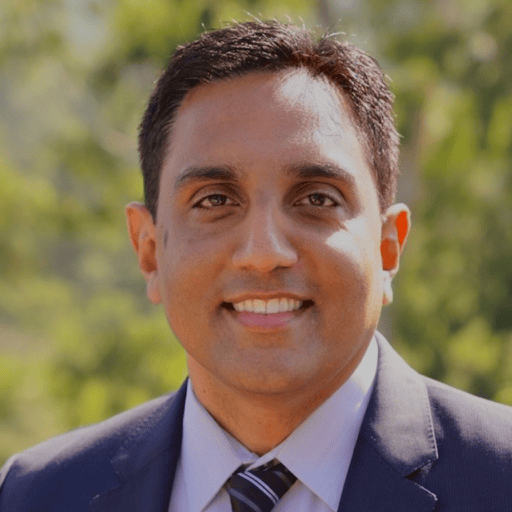
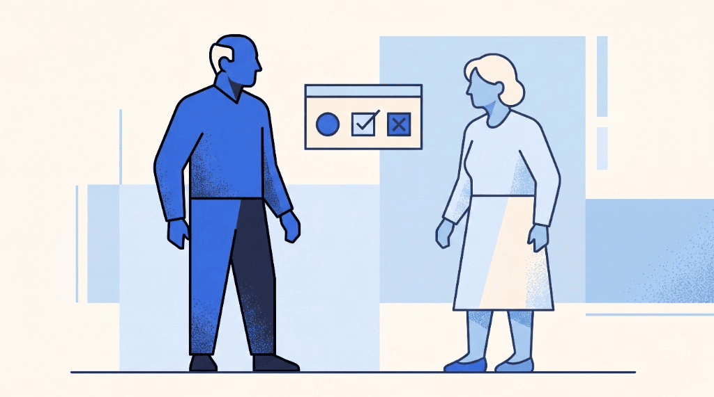

```{=html}
<div class="blog-shell">
  <div class="blog-article-grid">
    <div class="blog-prose-column">
      <a href="../media.html" class="article-back-link">
        <svg width="16" height="16" viewBox="0 0 24 24" fill="none" stroke="currentColor" stroke-width="2"><line x1="19" y1="12" x2="5" y2="12"/><polyline points="12 19 5 12 12 5"/></svg>
        Back to Blogs &amp; Media
      </a>

      <header class="mb-8">
        <div class="article-tags">
          <span class="article-tag-pill">CMS TEAM</span> <span class="article-tag-pill">Medicare reimbursement</span> <span class="article-tag-pill">hospital readmissions</span> <span class="article-tag-pill">value-based care</span> <span class="article-tag-pill">risk adjustment in value-based care</span> <span class="article-tag-pill">bundled payment analytics</span> <span class="article-tag-pill">geriatric surgery</span> <span class="article-tag-pill">Rainfall Health Podcast</span>
        </div>
        <div class="article-kicker">Media</div>
        <h1 class="article-h1">What Do Geriatric Patients Cost Under CMS TEAM — and What Can Hospitals Do About It?</h1>
        

        <div class="article-byline">
          <div class="byline-authors">
            <span class="author-chip"> <span>Dr. Hemant Keny</span></span> <span class="author-chip"> <span>Ahmed Qureshi</span></span>
          </div>
          <span class="byline-dot">&middot;</span>
          <span class="byline-date">July 21, 2026</span>

          <div class="article-share-actions">
            <a href="https://www.linkedin.com/sharing/share-offsite/?url=" target="_blank" rel="noopener noreferrer" class="share-btn" aria-label="Share on LinkedIn">
              <svg width="15" height="15" viewBox="0 0 24 24" fill="currentColor"><path d="M19 0h-14c-2.761 0-5 2.239-5 5v14c0 2.761 2.239 5 5 5h14c2.762 0 5-2.239 5-5v-14c0-2.761-2.238-5-5-5zm-11 19h-3v-11h3v11zm-1.5-12.268c-.966 0-1.75-.79-1.75-1.764s.784-1.764 1.75-1.764 1.75.79 1.75 1.764-.783 1.764-1.75 1.764zm13.5 12.268h-3v-5.604c0-3.368-4-3.113-4 0v5.604h-3v-11h3v1.765c1.396-2.586 7-2.777 7 2.476v6.759z"/></svg>
            </a>
            <a href="https://twitter.com/intent/tweet" target="_blank" rel="noopener noreferrer" class="share-btn" aria-label="Share on X">
              <svg width="14" height="14" viewBox="0 0 24 24" fill="currentColor"><path d="M18.244 2.25h3.308l-7.227 8.26 8.502 11.24H16.17l-5.214-6.817L4.99 21.75H1.68l7.73-8.835L1.254 2.25H8.08l4.713 6.231zm-1.161 17.52h1.833L7.084 4.126H5.117z"/></svg>
            </a>
            
            <a href="/downloads/Geriatric_surgical_patients_and_the_hidden_cost_driver_inside_TEAM_episodes.pdf" class="btn-download-ebook" target="_blank" rel="noopener noreferrer">
              <svg width="14" height="14" viewBox="0 0 24 24" fill="none" stroke="currentColor" stroke-width="2"><path d="M21 15v4a2 2 0 0 1-2 2H5a2 2 0 0 1-2-2v-4"/><polyline points="7 10 12 15 17 10"/><line x1="12" y1="15" x2="12" y2="3"/></svg>
              <span>Download eBook</span>
            </a>
            
          </div>
        </div>
      </header>

      

      <div class="article-body">
```


<div class="my-4"><iframe width="100%" height="180" frameborder="no" scrolling="no" seamless src="https://share.transistor.fm/e/184c60db"></iframe></div>

<aside class="blog-tldr not-prose"><div class="blog-tldr__label">TL;DR</div><div class="blog-tldr__body">
- TEAM covers 721 mandated hospitals
- Accountability includes 30 days post-discharge
- Geriatric frailty drives hidden episode costs
- Fix care design before surgery
- Optimize pre-op and post-acute pathways
</div></aside>

---

_Based on Rainfall Health Webinar Episode 2: The Forgotten Variable — Geriatric Surgical Patients & Hidden Cost Drivers in TEAM Episodes_

<div class="ratio ratio-16x9 my-4"><iframe src="https://www.youtube.com/embed/yMv1x7drTgU" title="YouTube video player" frameborder="0" allow="accelerometer; autoplay; clipboard-write; encrypted-media; gyroscope; picture-in-picture" allowfullscreen style="width:100%; height:400px; border-radius:8px;"></iframe></div>

---

## Introduction: The Patient Profile CMS TEAM Wasn't Built Around — But Will Be Decided By

The CMS TEAM model launched January 1, 2026, holding 721 acute-care hospitals accountable for the cost and quality of five high-volume surgical episodes. The policy language on the [CMS TEAM model page](https://www.cms.gov/priorities/innovation/innovation-models/team-model) talks about lower extremity joint replacement, spinal fusion, CABG, SHFFT, and major bowel procedures. What it doesn't say explicitly — but what any surgeon who operates on elderly patients already knows — is that the patient walking into that OR is increasingly over 75, on multiple medications, potentially frail, and carrying a constellation of geriatric vulnerabilities that no DRG code fully captures.

This post is drawn from a Rainfall Health webinar conversation with Dr. Hemant Keny, Regional Clinical Leader for Surgical Quality and Safety at Kaiser Permanente Northern California. Dr. Keny co-leads the Senior Surgical Care Program across 21 medical centers, sits on the American College of Surgeons geriatric surgery verification leadership committee, and has spent eight years systematically improving surgical outcomes at a population scale — not one patient at a time, but across an entire region of 4.5 million people. He has been featured on the Becker's Healthcare Podcast (May 2025) and in General Surgery News (January 2026).

What he shared isn't theoretical. It's the framework that hospitals winning under value-based care are already using — and that 721 mandated hospitals now need to understand before the first annual reconciliation comes due. **Risk adjustment in value-based care** does not erase frailty, delirium, or post-acute complexity; those factors still show up in episode spend, which is why hospitals need a working model of geriatric risk before they can interpret TEAM results. For how Rainfall frames common TEAM questions, see our [FAQ](/about/faq/).

---

## Who Is the Geriatric Surgical Patient — and Why Risk Adjustment in Value-Based Care Still Misses Them

At Kaiser Permanente Northern California, 7% of 4.5 million patients are 75 and older. Another 2% are 85 and older. Those percentages are only growing. And this population, Dr. Keny is direct about it, is categorically different from the standard adult surgical patient.

> They're on more medications, they have more risks, they're more frail. Because of that, we needed a system to manage them better so that their outcomes were better — and that we were providing goal-concordant care.
>
> — Dr. Hemant Keny, Kaiser Permanente Northern California

Goal-concordant care is a term that doesn't show up in CMS policy documents, but it sits at the heart of what TEAM is actually measuring. It means: patients who wanted surgery got it, patients who didn't want surgery and preferred alternative treatments got that, and every patient who went to the OR was as prepared as possible for what followed. When that framework is absent, episodes go over budget — not because the surgery was poor, but because everything around it was unmanaged.

**Why this matters for CMS TEAM specifically:** TEAM episodes include all Medicare Part A and B spending for 30 days post-discharge. For a frail 80-year-old who develops delirium, requires an ICU stay, and is readmitted within 20 days, that single episode can represent a significant loss against target price — regardless of how technically successful the procedure was.

---

## What Are Geriatric Vulnerabilities — and How Do They Drive Episode Cost?

Dr. Keny describes frailty as one of several "geriatric vulnerabilities" that hospitals must assess before surgery. Frailty is not simply age. An 80-year-old running marathons is not frail. An 80-year-old who is bedbound or barely ambulatory is. The difference in surgical outcomes between those two patients is enormous — and under TEAM, that difference is now a financial variable.

| Geriatric Vulnerability                  | Clinical Definition                                                                                                  | CMS TEAM Episode Cost Impact                                                                                        |
| ---------------------------------------- | -------------------------------------------------------------------------------------------------------------------- | ------------------------------------------------------------------------------------------------------------------- |
| **Frailty**                              | Overall aging and physiological weakness; independently associated with worse post-surgical outcomes                 | Longer LOS, higher readmission rate, higher post-acute utilization                                                  |
| **Cognitive impairment**                 | Underlying dementia or any degree of cognitive decline prior to surgery                                              | Primary driver of post-op delirium; significantly increases LOS and care intensity                                  |
| **Delirium (post-op)**                   | Acute confusion state following surgery; distinct from dementia but triggered by anesthesia, environment, and stress | ICU admission, extended LOS, long-term cognitive decline — among the most expensive complications in a TEAM episode |
| **Nutritional deficit**                  | Pre-operative malnutrition or insufficient caloric/protein status                                                    | Impaired wound healing, higher infection rates, longer recovery                                                     |
| **Mobility limitations**                 | Reduced pre-operative functional capacity                                                                            | Slower post-acute recovery, higher skilled nursing utilization, greater readmission risk                            |
| **Polypharmacy / high-risk medications** | Multiple concurrent medications flagged as high-risk in elderly patients                                             | Drug interactions, fall risk, delirium risk, delayed discharge                                                      |

> The more frail a patient is, the worse their outcomes tend to be after major surgery. And there are long-term changes — patients may not fully functionally recover from delirium. They may always have some degree of cognitive impairment long term.
>
> — Dr. Hemant Keny

Under a fee-for-service model, these complications generated more billing. Under the CMS TEAM model, every one of them is a direct reduction against the hospital's target price.

---

## What Does a TEAM-Ready Geriatric Patient Journey Look Like?

Dr. Keny walked through the patient journey that his team has built at Kaiser — one that starts far earlier than most hospital workflows are designed to support, and extends meaningfully past the OR door.

### Step 1: Goals-of-Care Conversation (Before Referral Acceptance)

The journey begins when a patient is first referred to the surgeon. Before anything else, the surgeon needs to have a goals-of-care conversation: What does the patient hope to gain from surgery? Is that realistic? What does the recovery look like? Does the patient understand the risks given their specific health profile?

This step directly affects episode cost in two ways. First, patients who choose not to have surgery following a thorough goals-of-care conversation are no longer in the episode at all — removing their risk entirely. Second, patients who proceed to surgery do so with informed expectations, which correlates with better compliance, better post-acute engagement, and fewer mid-episode surprises.

### Step 2: Pre-Operative Geriatric Assessment and Optimization

For patients proceeding to surgery, a formal geriatric assessment is required — not optional. This includes frailty scoring, cognitive screening, nutritional assessment, mobility evaluation, and medication review.

Where deficits are found, optimization begins before the surgical date is set. Dr. Keny is direct about this representing a culture shift:

> Before, our goal was efficiency — getting patients into surgery as quickly as possible. I think taking a step back and making sure that patients are optimized before surgery is better. Sometimes that takes weeks. Sometimes it can take months.
>
> — Dr. Hemant Keny

Patients who enter surgery nutritionally replete, off high-risk medications, with better baseline mobility, and with cognitive risks identified in advance have measurably better outcomes — and lower total episode cost.

### Step 3: In-Hospital Geriatric Care Protocols

During the hospital stay, Dr. Keny's program incorporates daily assessments specifically designed to prevent delirium. This includes what his team calls "PSSE" — ensuring patients have their personal sensory supports: dentures, glasses, and hearing aids. Disorientation after major surgery often begins with sensory deprivation, and these simple interventions have a measurable effect on delirium incidence.

Geriatric-friendly room design, early mobilization protocols, and sleep hygiene practices all contribute to the same goal: preventing the complications that extend length of stay and generate the post-acute costs that blow up TEAM episode budgets.

### Step 4: Discharge Assessment and Post-Acute Coordination

At discharge, another formal assessment determines the right post-acute setting — home, skilled nursing facility, or rehabilitation. Social workers and patient care coordinators drive this process. The goal is to match each patient to the appropriate level of care, preventing both under-placement (patient returns to ED within days) and over-placement (unnecessary skilled nursing utilization that inflates episode cost without improving outcomes).

> All of these things are to help patients recover better at home so that they're less likely to get readmitted. It helps with decreasing length of stay in the hospital as well as decreasing the readmission rate.
>
> — Dr. Hemant Keny

---

## Why Does Improving Quality Lower Cost — Not the Other Way Around?

This is the inversion that most hospital finance teams haven't fully internalized yet. The instinct under a bundled-payment model is to focus on cost reduction — cutting post-acute utilization, shortening length of stay, reducing referrals to higher-cost facilities. Dr. Keny's framing is the opposite.

> You have to think of it as improving quality will improve cost — not the other way around. When you improve quality, you will decrease cost.
>
> — Dr. Hemant Keny

The math is straightforward. Every post-surgical infection has a cost. Every readmission restarts the episode clock and adds cost. Every ICU stay following a preventable delirium episode has a cost. Every extra day of length of stay has a cost. Preventing those outcomes — through pre-operative optimization, in-hospital geriatric protocols, and coordinated post-acute care — is not a patient-care luxury. It is the financial strategy for CMS TEAM.

**The compound benefit:** When a hospital invests in geriatric assessment infrastructure, it captures benefits in three places simultaneously: (1) patients who choose not to have surgery are removed from episode risk entirely; (2) patients who proceed to surgery do so with lower complication profiles; (3) patients who are discharged are matched to the right care setting, reducing readmission and over-utilization.

---

## What Is the Geriatric Surgery Verification Program — and Should CMS TEAM Hospitals Pursue It?

The American College of Surgeons Geriatric Surgery Verification (GSV) program is the national standard for geriatric surgical care. Hospitals that achieve verification have implemented the full bundle of evidence-based interventions across pre-operative assessment, in-hospital protocols, and post-discharge coordination.

Kaiser Permanente Northern California has 14 of its 21 hospitals verified at the highest level — "Comprehensive Excellence." That represents nearly half of all hospitals nationwide verified at that tier.

Dr. Keny served as one of the pilot sites for the GSV program and now sits on its national leadership committee at the ACS. His view on whether TEAM-mandated hospitals should pursue verification is unambiguous:

> All of the interventions we have implemented are applicable to all of those different specialties. Whether you're having cardiac surgery, orthopedic surgery, general surgery, vascular surgery — all of those patients are potentially high-risk.
>
> — Dr. Hemant Keny

| GSV Program Component                                                        | Relevance to CMS TEAM Episodes                                                                        |
| ---------------------------------------------------------------------------- | ----------------------------------------------------------------------------------------------------- |
| Pre-operative geriatric assessment (frailty, cognition, nutrition, mobility) | Identifies high-risk patients before surgery; enables optimization that reduces complications and LOS |
| Goals-of-care conversation protocol                                          | Reduces unnecessary high-risk procedures; aligns patient expectations with recovery realities         |
| Delirium prevention bundle (PSSE, daily assessment, early mobilization)      | Directly reduces ICU admissions and extended LOS — two of the largest cost drivers in TEAM episodes   |
| Medication optimization / deprescribing                                      | Reduces fall risk, drug interactions, and delirium triggers prior to surgery                          |
| Post-acute placement coordination                                            | Matches patients to appropriate care settings; reduces readmissions within the 30-day episode window  |
| Patient and family education                                                 | Improves post-discharge compliance and reduces avoidable ED visits within the episode                 |

---

## What Role Does AI Play in Managing Geriatric Surgical Episodes Under TEAM?

Dr. Keny's view on AI in this space is measured and practical. He is already using AI-assisted scribing in his own clinical practice. He sees the trajectory clearly: AI will increasingly be used to identify high-risk patients in real time, flag missing interventions, and surface tailored recommendations to care teams.

> The AI needs to use what the current literature states — what the best practices are — and that needs to be built into it. It needs to have access to patient data to identify who is frail, who is high-risk, and then give tailored recommendations to those providers so that we can get real-time recommendations for what can be done.
>
> — Dr. Hemant Keny

Rainfall Health's position is aligned: the human has to remain in the loop. AI can surface the risk signal — but the care coordinator, the case manager, and the surgeon are the ones who act on it. The R.A.I.N. Compliant™ platform is built on this principle: AI-enabled episode management that augments clinical teams rather than replacing the human judgment at the center of each patient relationship.

> Healthcare is between doctor and patient. That will never change.
>
> — Dr. Hemant Keny

---

## How Long Does It Take to Implement — and What Gets in the Way?

> It takes 17 years in the healthcare system for something to go from being known to being routine. We have to speed that time up.
>
> — Dr. Hemant Keny

The barriers are familiar. Early adopters run with new protocols immediately. Resistors oppose change regardless of evidence. The majority is in the middle: open to change, but waiting to see results before committing. Dr. Keny's prescription for that group is patient stories.

> I have hundreds of stories of patients who have come back and told us about their experience — how much better it was than what they were doing before. Some people had a knee replacement on one side using our old system, and then they had their knee replacement on the other side with our new system. They tell us it's so much better the way we're doing it now.
>
> — Dr. Hemant Keny

The combination of financial accountability from CMS TEAM and clinical evidence from programs like ACS GSV gives hospitals the both/and argument they need: better for patients, better for the balance sheet.

---

## What Should Mandated Hospitals Do Now?

The CMS TEAM model is active. The 30-day post-discharge episode window is running on every eligible procedure at 721 mandated hospitals. The geriatric patient population is not a niche edge case — it is the mainstream of the procedures TEAM covers.

| Action                                                                                     | Timeline                  | Impact on TEAM Episode Cost                                                                      |
| ------------------------------------------------------------------------------------------ | ------------------------- | ------------------------------------------------------------------------------------------------ |
| Conduct a geriatric vulnerability screening audit across all TEAM-eligible procedures      | Immediate (30–60 days)    | Identifies current exposure; baselines frailty and delirium rates                                |
| Implement goals-of-care conversation protocol for all TEAM-eligible referrals              | Short-term (60–90 days)   | Reduces unnecessary high-risk procedures; removes highest-risk patients from episode pool        |
| Deploy pre-operative optimization protocols for high-risk patients                         | Short-term (90 days)      | Reduces complication rates; improves target price performance at reconciliation                  |
| Launch in-hospital delirium prevention bundle (PSSE, daily assessment, early mobilization) | Medium-term (90–180 days) | Directly reduces LOS and ICU utilization                                                         |
| Establish post-acute network coordination for 30-day episode window                        | Medium-term (90–180 days) | Reduces readmissions; matches patients to appropriate care settings                              |
| Pursue ACS Geriatric Surgery Verification (GSV) program                                    | Long-term (12–24 months)  | Systematizes all of the above; provides external validation and continuous improvement framework |

Rainfall Health is the first and only recognized standard for Medicare-mandated models like CMS TEAM. The R.A.I.N. Compliant™ platform integrates compliance, case management, and care coordination across all five TEAM surgical episodes — with AI-enabled episode design that helps hospitals identify the geriatric risk factors driving hidden episode costs before they show up at annual reconciliation.

---

## Frequently Asked Questions: Geriatric Patients and CMS TEAM Episode Costs

### Why are elderly patients a particular financial risk under CMS TEAM?

Under the CMS TEAM model, hospitals are accountable for all Medicare Part A and B spending in a 30-day post-discharge window. Elderly patients — particularly those with frailty, cognitive impairment, or nutritional deficits — have significantly higher rates of post-surgical complications including delirium, extended length of stay, ICU admission, and readmission. Each of these complications adds cost to the episode budget without improving outcomes.

### What is frailty and how does it affect surgical episode outcomes?

Frailty is a measure of overall physiological aging and weakness — distinct from chronological age. A frail patient has reduced physiological reserve, meaning they recover more slowly from the stress of major surgery, are more susceptible to complications, and require more post-acute support. Under CMS TEAM, higher frailty is directly correlated with higher episode cost — longer LOS, more readmissions, and greater skilled nursing utilization within the 30-day window.

### What is post-operative delirium and why is it so expensive under bundled payment models?

Post-operative delirium is an acute confusion state that occurs after surgery, commonly triggered in elderly patients by anesthesia, unfamiliar environments, and sensory deprivation. It is associated with ICU admission, significantly extended length of stay, and long-term cognitive decline. Under the CMS TEAM model, delirium is one of the most expensive single complications that can occur within an episode — it directly increases total episode spending above target price.

### What is a geriatric assessment and should it be required before TEAM-eligible procedures?

A geriatric assessment is a structured, objective evaluation of a patient's frailty level, cognitive status, nutritional status, mobility, and medication profile. For TEAM-mandated hospitals, conducting geriatric assessments prior to elective TEAM-eligible procedures is an emerging best practice that enables pre-operative optimization, more appropriate patient selection, and better post-discharge planning — all of which reduce episode cost at annual reconciliation.

### What is the ACS Geriatric Surgery Verification program?

The American College of Surgeons Geriatric Surgery Verification (GSV) program is a national credentialing program for hospitals that implement a comprehensive bundle of evidence-based geriatric surgical care interventions. Kaiser Permanente Northern California has nearly half of all nationally verified hospitals at the highest tier — Comprehensive Excellence — across 14 of its 21 medical centers.

### How does pre-operative patient optimization reduce CMS TEAM episode costs?

Pre-operative optimization — improving nutritional status, reducing high-risk medications, improving baseline mobility, and addressing cognitive risks before surgery — directly reduces the incidence of post-surgical complications. Fewer complications mean shorter length of stay, fewer ICU admissions, fewer readmissions, and lower total episode spending. Under the TEAM model's target-price mechanism, this improvement in quality translates directly to better financial performance at annual reconciliation.

### How does goals-of-care counseling connect to Medicare reimbursement under CMS TEAM?

Under the CMS TEAM model, elective procedures are the highest-volume episode category. A thorough goals-of-care conversation before surgery allows patients who prefer alternative treatments — or who decide not to proceed after understanding their risk profile — to make that informed choice. Patients who do not proceed to surgery are not in an episode at all, removing their risk from the hospital's episode budget entirely.

### What does the 30-day post-discharge window mean for geriatric patient management?

The CMS TEAM model's 30-day post-discharge window means hospitals are financially responsible for readmissions, ED visits, skilled nursing utilization, and other Medicare-covered services for a full month after a patient leaves the hospital. For elderly patients with complex post-acute needs, this window is where episode budgets are most at risk. Effective post-acute coordination — matching patients to the right care setting and monitoring them during the 30-day window — is the primary lever for controlling episode cost in this population.

---

---

## Download the eBook

<a
  href="/downloads/Geriatric_surgical_patients_and_the_hidden_cost_driver_inside_TEAM_episodes.pdf"
  target="_blank"
  rel="noopener noreferrer"
>
  Download the eBook: The Forgotten Variable
</a>

## Get Your Free CMS TEAM Episode Analysis

Rainfall Health will run a free analysis of your 2024 Medicare billings and produce an individualized view of your potential upside and downside under the CMS TEAM model — including procedure-level episode cost breakdowns that surface where geriatric patient risk is concentrated.

- **Request a demo + free analysis:** [/schedule-a-demo/](/schedule-a-demo/)
- **Learn more about the platform:** [/team/](/team/)

## Further reading

- [CMS TEAM Guide](/cms-team/) — hub overview
- [What Is TEAM?](/cms-team/what-is-team/) — canonical CMS TEAM model definition
- [What Is TEAM?](/cms-team/what-is-team/) — 30-day episode window
- [Hospital List](/cms-team/participating-hospitals/list/) — search mandated hospitals
- [Maximize TEAM Revenue](/cms-team/maximize-revenue/) — CFO playbook
- [TEAM vs BPCI Advanced](/cms-team/team-vs-bpci-advanced/)
- [TEAM vs CJR](/cms-team/team-vs-cjr/)

---

_Dr. Hemant Keny is Regional Clinical Leader for Surgical Quality and Safety at Kaiser Permanente Northern California, where he co-leads the Senior Surgical Care Program across 21 medical centers. He serves on the leadership committee of the American College of Surgeons Geriatric Surgery Verification program, has been featured on the Becker's Healthcare Podcast (May 2025), and was profiled in General Surgery News (January 2026)._

_Ahmed "Eddie" Qureshi is Founder and CEO of Rainfall Health (Bettermeant Inc.)._

_This article is for informational purposes only and is not legal, financial, or clinical advice. © 2026 Rainfall Health._


```{=html}
      </div>
    </div>

    <!-- Sticky Right Featured Sidebar (Screenshots 2-4) -->
    <aside class="blog-featured not-prose" aria-labelledby="blog-featured-heading">
      <h2 id="blog-featured-heading" class="blog-featured__heading">Featured</h2>
      <ul class="blog-featured__list">
        
              <li>
                <a href="the-trust-gap-health-data-governance-cora-han.html" class="blog-featured__link">
                  
                  <span class="blog-featured__title">The Trust Gap: Cora Han on Health Data Governance, Responsible AI, and Care Transitions</span>
                </a>
              </li>
            

              <li>
                <a href="cms-team-safety-net-hospitals-sandra-scott.html" class="blog-featured__link">
                  
                  <span class="blog-featured__title">How Is the CMS TEAM Model Reshaping Leadership at Safety Net Hospitals?</span>
                </a>
              </li>
            

              <li>
                <a href="hip-fracture-home-scott-cooper.html" class="blog-featured__link">
                  
                  <span class="blog-featured__title">Patients Do Better at Home: Dr. Scott Cooper on Hip Fractures, TEAM, and the 90-Day Episode</span>
                </a>
              </li>
            

              <li>
                <a href="rainfall-health-adds-three-new-rain-compliant-partners.html" class="blog-featured__link">
                  
                  <span class="blog-featured__title">Rainfall Health Adds Three New Partners to its Verified Ecosystem to Help Hospitals Meet Federal CMS Mandates</span>
                </a>
              </li>
            

              <li>
                <a href="bundled-payment-analytics-steve-schutzer.html" class="blog-featured__link">
                  
                  <span class="blog-featured__title">Physician-Led Bundled Payments Work: Dr. Steve Schutzer on 20 Years of Joint Replacement Data</span>
                </a>
              </li>
            

              <li>
                <a href="ai-leverage-mark-adams-two-bear-capital.html" class="blog-featured__link">
                  
                  <span class="blog-featured__title">AI Won't Replace Nurses — It Will Give Them Leverage: Mark Adams on the Future of Healthcare AI</span>
                </a>
              </li>
            
      </ul>
    </aside>
  </div>
</div>
```
