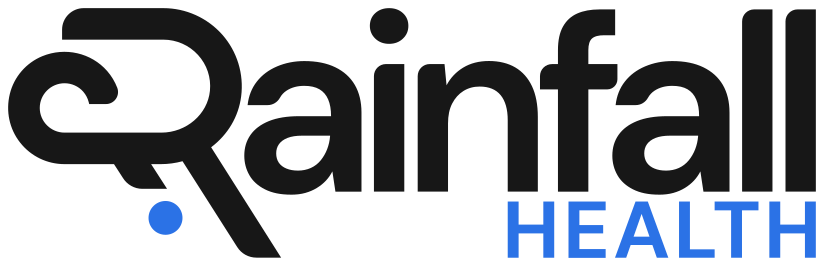

```{=html}
<div class="blog-shell">
  <div class="blog-article-grid">
    <div class="blog-prose-column">
      <a href="../media.html" class="article-back-link">
        <svg width="16" height="16" viewBox="0 0 24 24" fill="none" stroke="currentColor" stroke-width="2"><line x1="19" y1="12" x2="5" y2="12"/><polyline points="12 19 5 12 12 5"/></svg>
        Back to Blogs &amp; Media
      </a>

      <header class="mb-8">
        <div class="article-tags">
          <span class="article-tag-pill">CMS TEAM</span> <span class="article-tag-pill">CJR-X</span> <span class="article-tag-pill">R.A.I.N.</span> <span class="article-tag-pill">partners</span> <span class="article-tag-pill">value-based care</span> <span class="article-tag-pill">post-acute care</span>
        </div>
        <div class="article-kicker">Media</div>
        <h1 class="article-h1">Rainfall Health Adds Three New Partners to its Verified Ecosystem to Help Hospitals Meet Federal CMS Mandates</h1>
        

        <div class="article-byline">
          <div class="byline-authors">
            <span class="author-chip"> <span>Rainfall Health</span></span>
          </div>
          <span class="byline-dot">&middot;</span>
          <span class="byline-date">September 22, 2026</span>

          <div class="article-share-actions">
            <a href="https://www.linkedin.com/sharing/share-offsite/?url=" target="_blank" rel="noopener noreferrer" class="share-btn" aria-label="Share on LinkedIn">
              <svg width="15" height="15" viewBox="0 0 24 24" fill="currentColor"><path d="M19 0h-14c-2.761 0-5 2.239-5 5v14c0 2.761 2.239 5 5 5h14c2.762 0 5-2.239 5-5v-14c0-2.761-2.238-5-5-5zm-11 19h-3v-11h3v11zm-1.5-12.268c-.966 0-1.75-.79-1.75-1.764s.784-1.764 1.75-1.764 1.75.79 1.75 1.764-.783 1.764-1.75 1.764zm13.5 12.268h-3v-5.604c0-3.368-4-3.113-4 0v5.604h-3v-11h3v1.765c1.396-2.586 7-2.777 7 2.476v6.759z"/></svg>
            </a>
            <a href="https://twitter.com/intent/tweet" target="_blank" rel="noopener noreferrer" class="share-btn" aria-label="Share on X">
              <svg width="14" height="14" viewBox="0 0 24 24" fill="currentColor"><path d="M18.244 2.25h3.308l-7.227 8.26 8.502 11.24H16.17l-5.214-6.817L4.99 21.75H1.68l7.73-8.835L1.254 2.25H8.08l4.713 6.231zm-1.161 17.52h1.833L7.084 4.126H5.117z"/></svg>
            </a>
            
          </div>
        </div>
      </header>

      

      <div class="article-body">
```


San Francisco, September 22, 2026 — Rainfall Health, the leading AI-driven compliance and reimbursement platform for hospitals, today announced HNI Healthcare, Goldfinch Health, and LainaHealth as the three newest [R.A.I.N. Compliant™](/team/) partners in the company's trusted ecosystem of service providers and medical groups. Together, these healthcare organizations will help hospitals and providers avoid a projected $1.2 million average revenue loss and unlock up to $85M under the federal [CMS TEAM](/cms-team/) mandate, while also adhering to key value-based care metrics recently codified under the [Comprehensive Care for Joint Replacement Expansion (CJR-X)](/cjrx/).

Rainfall created its R.A.I.N. Compliant™ designation as a verifiable, audited, and AI-enabled framework adopted by hospitals and payers to help them deliver on the growing list of rigorous CMS mandates. The designation also extends to partners who have demonstrated a commitment to data transparency, quality improvement, patient centered care, and cost efficiency – all to help health systems and medical groups achieve excellence in mandatory value-based care programs.

Health systems and providers that opt to build value-based care infrastructure themselves rather than working with Rainfall stand to face significant administrative costs. In fact, estimated annual cost increases per acute-care hospital are currently ranging from $650,000 to $1.23M (JAMA, August 2026).

<BlogLeadQuote>

"This new cohort of R.A.I.N. partners stands ready to help hospitals navigate the new era of value-based care, a shift recently solidified by the CJR-X codification last month," said Eddie Qureshi, CEO and Founder of Rainfall Health. "We know an industry shift can only be made successfully through significant collaboration, which is why we're dedicated to building a robust and trusted ecosystem of hospitals and service providers. Together, we're setting the standard for what quality and accountability should look like – and making sure that our priorities align with CMS policies and guidelines."

</BlogLeadQuote>

This ecosystem expansion comes at a critical time, as CMS is in full swing with TEAM, impacting 721 hospitals nationwide. Further, last month CMS finalized the extension of CJR-X starting in January 2028. Both of these initiatives hold hospitals financially and clinically accountable for patient outcomes across entire 30 and 90 day episodes.

## HNI Healthcare

HNI Healthcare, which has more than 500 providers in its network, has already spent seven years working with health systems to deliver under the Bundled Payments for Care Improvement (BCPI) Initiative, which was the predecessor to TEAM.

<BlogLeadQuote>

"HNI is excited to partner with Rainfall Health as we continue to create high-performing integrated networks that deliver care for our health system and post-acute partners' most fragile patients. HNI works with health systems to address key gaps in clinical resources while integrating technologies that are foundational for care navigation and enable the discipline required to deliver under risk-based models like TEAM and CJR-X," said Sean Burns, Executive Vice President at HNI Healthcare. "Our partnership with Rainfall is grounded in a shared commitment to delivering scalable high-quality healthcare. As a R.A.I.N. Compliant™ partner, HNI provides an extensible solution that can include specifically-trained clinical staffing and technology-enabled operations support."

</BlogLeadQuote>

While value-based care has been a priority for many healthcare organizations over the past several years, new federal mandates have expedited this. In order to reach the acceleration that CMS is pushing, hospitals must move beyond the operating room to address wrap-around factors that improve outcomes and demonstrate measurable results. This means superior post-op care that relies on continuous patient engagement, personalized care plans, proactive intervention, and longitudinal outcomes measurement to lower cost of care while optimizing patient satisfaction and recovery.

## Goldfinch Health

<BlogLeadQuote>

"At Goldfinch Health, our mission is to optimize surgical recovery and deliver measurable value in care," said Brand Newland, CEO and Co-Founder of Goldfinch Health. "Working with partners like Rainfall reinforces this mission, and allows us to equip hospitals with the tools, data, and collaboration needed to meet TEAM and other value-based care initiatives. At the end of the day, we are improving patient care and strengthening the health of the communities we serve – while helping hospitals meet their bottom line."

</BlogLeadQuote>

From pre-operative optimization and acute clinical staffing to post-acute navigation and virtual physical therapy with recovery monitoring, this ecosystem of partners is working to ensure patients receive seamless, high touch support throughout every phase of the surgical care journey.

## LainaHealth

<BlogLeadQuote>

"Recovery doesn't end at surgical discharge. That's where it begins, and it has long been the part of the episode hospitals can see the least," said Ryan Eder, Founder and CEO of LainaHealth. "LainaHealth's care model pairs licensed physical therapists with continuous motion and outcomes tracking technology, so patients get live, one-to-one support at home while health systems gain continuous, longitudinal visibility into the patient care journey, along with the data required by models like TEAM and CJR-X. As a R.A.I.N. Compliant™ partner, we're putting that visibility to work where hospitals are now held accountable: better recoveries, made measurable."

</BlogLeadQuote>

To learn more about being R.A.I.N. Compliant™, visit the [R.A.I.N. Compliant™ platform](/team/) on rainfallhealth.com.

[Read the full release on PR Newswire](https://www.prnewswire.com/news-releases/rainfall-health-adds-three-new-partners-to-its-verified-ecosystem-to-help-hospitals-meet-federal-cms-mandates-302884903.html).

---

### About Rainfall Health

Rainfall Health is an AI-driven compliance and reimbursement platform helping hospitals and medical groups navigate new federal mandates such as CMS's TEAM model and CJR-X. The company is shaping a new national standard for mandated care model compliance through the RAIN Compliant™ designation which is a verifiable, AI-enabled framework adopted by hospitals, payers, and clinical partners. Rainfall works with health system executives, physician groups, and post-acute partners to automate complex regulatory requirements, improve care-quality performance, and unlock new Medicare revenue streams. Follow Rainfall Health on LinkedIn and Twitter.

### About HNI Healthcare

HNI Healthcare combines clinical services with integrative technologies to align exceptional patient outcomes and appropriate resource utilization. The company's proprietary VitalsMD™ platform gives clinicians the information needed to make key decisions at the point of care while providing operational leaders the tools and framework required to build high-performing care networks at scale. HNI's insights are informed by more than 15 years of experience and millions of patient encounters. HNI Healthcare remains a trusted partner for health systems, post-acute operators and managed care groups because durable results speak for themselves. Visit [HNIHealthcare.com](https://www.hnihealthcare.com/) to learn more.

### About Goldfinch Health

Goldfinch Health is a leading care navigation company dedicated to improving surgical recovery, enhancing patient outcomes, and reducing avoidable healthcare costs. Through evidence-based care pathways and personalized nurse navigation, Goldfinch Health empowers patients and providers to achieve safer, faster recoveries. Partnering with health systems, employers, and payers nationwide, the company delivers measurable improvements in quality, accountability, and patient experience, helping to build healthier communities and a more sustainable healthcare system.

### About LainaHealth

LainaHealth is a nationwide virtual physical therapy practice built to break down the barriers to accessing clinical, measured care. LainaHealth's care model pairs licensed clinicians with Laina, a live artificial intelligence navigation assistant, to combine live telehealth visits with interactive, measured care plans that patients complete at home through their own devices. LainaHealth's HIPAA-compliant, Class II FDA-registered platform serves health plans, health systems, and medical practices, driving patient engagement and providing continuous, longitudinal visibility into the patient care journey through outcomes data. Learn more at [lainahealth.com](https://www.lainahealth.com/) and follow LainaHealth on LinkedIn.

<BlogReferences items={[{"id":1,"text":"Rainfall Health, \"Rainfall Health Adds Three New Partners to its Verified Ecosystem to Help Hospitals Meet Federal CMS Mandates,\" press release, September 2026.","url":"https://www.prnewswire.com/news-releases/rainfall-health-adds-three-new-partners-to-its-verified-ecosystem-to-help-hospitals-meet-federal-cms-mandates-302884903.html"}]} />


```{=html}
      </div>
    </div>

    <!-- Sticky Right Featured Sidebar (Screenshots 2-4) -->
    <aside class="blog-featured not-prose" aria-labelledby="blog-featured-heading">
      <h2 id="blog-featured-heading" class="blog-featured__heading">Featured</h2>
      <ul class="blog-featured__list">
        
              <li>
                <a href="the-trust-gap-health-data-governance-cora-han.html" class="blog-featured__link">
                  
                  <span class="blog-featured__title">The Trust Gap: Cora Han on Health Data Governance, Responsible AI, and Care Transitions</span>
                </a>
              </li>
            

              <li>
                <a href="cms-team-safety-net-hospitals-sandra-scott.html" class="blog-featured__link">
                  
                  <span class="blog-featured__title">How Is the CMS TEAM Model Reshaping Leadership at Safety Net Hospitals?</span>
                </a>
              </li>
            

              <li>
                <a href="hip-fracture-home-scott-cooper.html" class="blog-featured__link">
                  
                  <span class="blog-featured__title">Patients Do Better at Home: Dr. Scott Cooper on Hip Fractures, TEAM, and the 90-Day Episode</span>
                </a>
              </li>
            

              <li>
                <a href="bundled-payment-analytics-steve-schutzer.html" class="blog-featured__link">
                  
                  <span class="blog-featured__title">Physician-Led Bundled Payments Work: Dr. Steve Schutzer on 20 Years of Joint Replacement Data</span>
                </a>
              </li>
            

              <li>
                <a href="ai-leverage-mark-adams-two-bear-capital.html" class="blog-featured__link">
                  
                  <span class="blog-featured__title">AI Won't Replace Nurses — It Will Give Them Leverage: Mark Adams on the Future of Healthcare AI</span>
                </a>
              </li>
            

              <li>
                <a href="hospitals-that-will-win-on-cms-team-have-already-started.html" class="blog-featured__link">
                  
                  <span class="blog-featured__title">The Hospitals That Will Win on CMS TEAM Have Already Started</span>
                </a>
              </li>
            
      </ul>
    </aside>
  </div>
</div>
```
