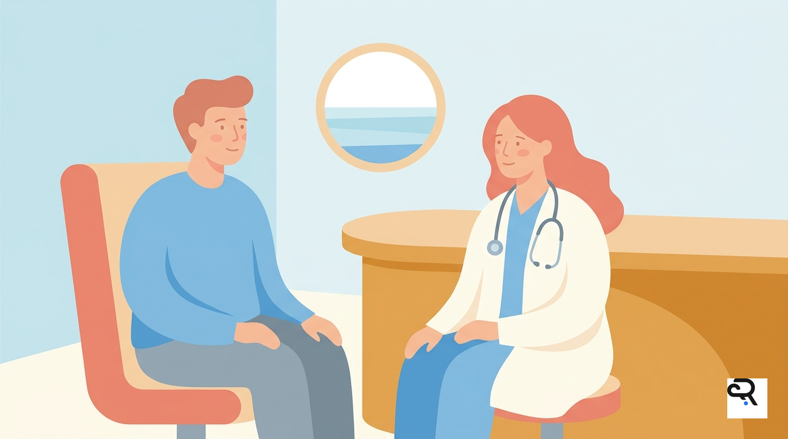
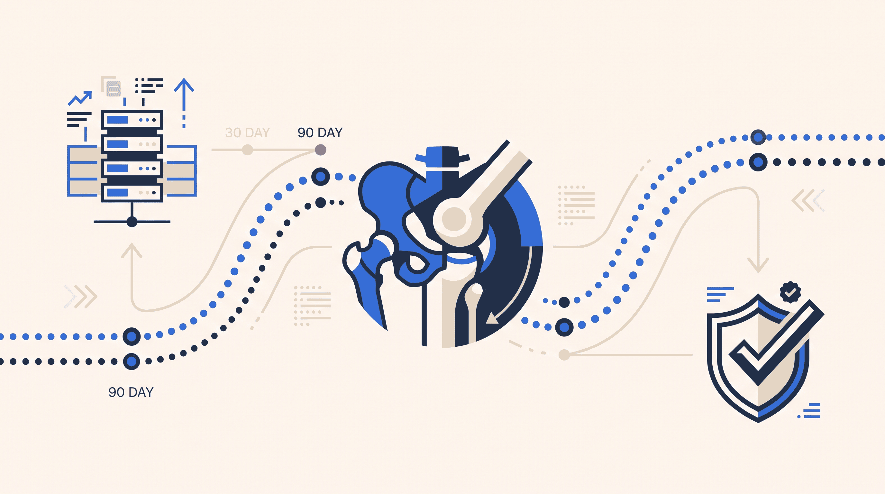
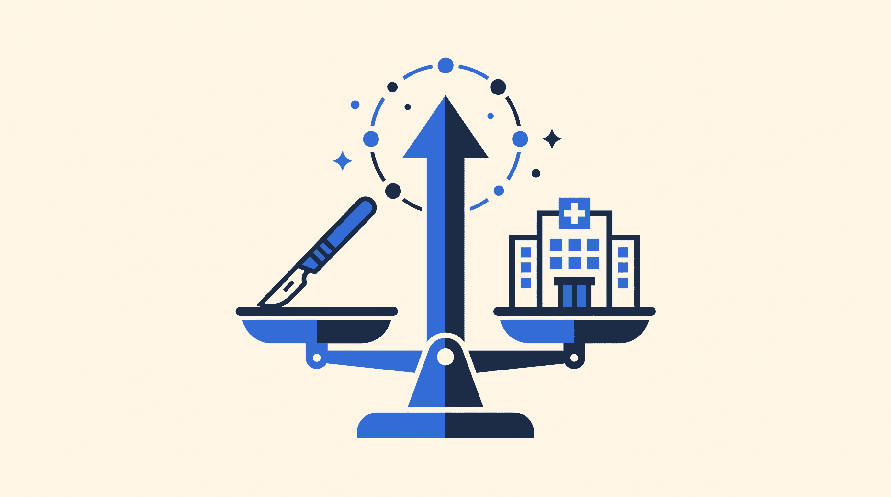

```{=html}
<div class="studio-container">
  <div class="studio-header">
    <div class="studio-badge">
      <span>⚡ Powered by Gemini 3 Pro &amp; Nano Banana Pro</span>
    </div>
    <h1 class="studio-title">Marketing &amp; Episode Production Studio</h1>
    <p class="studio-subtitle">
      Automated all-in-one publishing pipeline for Rainfall Health podcasts and executive research. 
      Input an episode transcript or topic brief to generate 4 branded 16:9 thumbnails, YouTube CTR kits, 
      LinkedIn thought-leadership posts, Transistor HTML show notes, Quarto blog articles, and SRT subtitles all at once.
    </p>
  </div>

  <div class="studio-layout">
    <!-- Left Input Panel -->
    <div class="studio-input-card">
      <h2 style="font-size:1.15rem; font-weight:700; color:var(--studio-navy); margin-top:0; margin-bottom:1.25rem;">
        1. Episode / Article Input
      </h2>

      <div class="studio-form-group">
        <label class="studio-label" for="input-title">Episode Title or Topic</label>
        <input type="text" id="input-title" class="studio-input" placeholder="e.g. Dr. Steve Schutzer on Bundled Payment Analytics & TEAM" value="Dr. Steve Schutzer on Bundled Payment Analytics & at the Head of the Table">
      </div>

      <div class="studio-form-group" style="display:grid; grid-template-columns:1fr 1fr; gap:0.75rem;">
        <div>
          <label class="studio-label" for="input-guest">Guest Name</label>
          <input type="text" id="input-guest" class="studio-input" placeholder="e.g. Dr. Steve Schutzer" value="Dr. Steve Schutzer">
        </div>
        <div>
          <label class="studio-label" for="input-role">Title / Organization</label>
          <input type="text" id="input-role" class="studio-input" placeholder="e.g. Orthopedic Surgeon" value="Orthopedic Surgeon & Value Leader">
        </div>
      </div>

      <div class="studio-form-group">
        <label class="studio-label" for="input-notes">Transcript or Topic Notes</label>
        <textarea id="input-notes" class="studio-textarea" placeholder="Paste full transcript, show notes, or key discussion points...">Dr. Steve Schutzer discusses why orthopedic surgeons must be at the head of the table under the CMS TEAM mandate. He explores the transition from voluntary CJR bundled payments to mandatory 30-day TEAM episodes, clinical alignment, post-acute care coordination, and why surgical leaders need real-time data transparency to control readmission risk.</textarea>
      </div>

      <div class="studio-form-group">
        <label class="studio-label">Thumbnail Style Reference</label>
        <div class="style-cards-grid">
          <div class="style-card active" onclick="selectStyle(this, 'editorial')">
            <div class="style-card-title">Editorial Brand</div>
            <div class="style-card-desc">Clouds, clean panels, modern healthcare desk</div>
          </div>
          <div class="style-card" onclick="selectStyle(this, 'interview')">
            <div class="style-card-title">Clinician Interview</div>
            <div class="style-card-desc">Friendly figures, clipboard, discussion desk</div>
          </div>
          <div class="style-card" onclick="selectStyle(this, 'data')">
            <div class="style-card-title">Data &amp; Analytics</div>
            <div class="style-card-desc">Stacked metrics, colored bars, ice blue grid</div>
          </div>
          <div class="style-card" onclick="selectStyle(this, 'care')">
            <div class="style-card-title">Patient Journey</div>
            <div class="style-card-desc">Home care transition, recovery, caregiver</div>
          </div>
        </div>
      </div>

      <div class="studio-form-group">
        <label class="studio-label" for="input-scene">Visual Scene Customization (1 Sentence)</label>
        <input type="text" id="input-scene" class="studio-input" value="A healthcare leader and clinician seated across a sleek minimalist desk in thoughtful discussion, with a floating clipboard and comparison panel above them.">
      </div>

      <button id="btn-run" class="btn-generate" onclick="generateEpisodeKit()">
        <span id="btn-text">🚀 Generate Complete Episode Kit</span>
        <span id="btn-spinner" class="spinner" style="display:none;"></span>
      </button>

      <p style="font-size:0.75rem; color:var(--studio-slate); text-align:center; margin-top:0.85rem; margin-bottom:0;">
        Directly linked to Artometrics Tier 1 Gemini Engine
      </p>
    </div>

    <!-- Right Results Hub -->
    <div class="studio-results-card">
      <div class="studio-tabs">
        <button class="studio-tab-btn active" onclick="openTab(this, 'tab-thumbnails')">🎨 Thumbnails</button>
        <button class="studio-tab-btn" onclick="openTab(this, 'tab-youtube')">▶️ YouTube Kit</button>
        <button class="studio-tab-btn" onclick="openTab(this, 'tab-linkedin')">💼 LinkedIn Post</button>
        <button class="studio-tab-btn" onclick="openTab(this, 'tab-transistor')">🎙️ Transistor Notes</button>
        <button class="studio-tab-btn" onclick="openTab(this, 'tab-blog')">📝 Quarto Blog (.qmd)</button>
        <button class="studio-tab-btn" onclick="openTab(this, 'tab-srt')">⏱️ Subtitles (SRT)</button>
      </div>

      <!-- Tab 1: Thumbnails -->
      <div id="tab-thumbnails" class="studio-tab-content active">
        <div style="display:flex; align-items:center; justify-content:space-between; margin-bottom:1rem;">
          <h3 style="font-size:1.1rem; font-weight:700; color:var(--studio-navy); margin:0;">
            Nano Banana Pro 16:9 Banner Variations
          </h3>
          <span style="font-size:0.8125rem; font-weight:600; color:var(--studio-blue); background:var(--studio-blue-light); padding:0.25rem 0.6rem; border-radius:6px;">
            Auto-Branded with Rainfall Signet
          </span>
        </div>

        <div class="banner-variations-grid" id="banner-grid">
          <div class="banner-item">
            <div class="banner-img-wrap">
              
            </div>
            <div class="banner-item-footer">
              <span class="banner-item-title">Banner A &middot; Editorial Desk</span>
              <a href="assets/media/test_rainfall_banner_watermarked.png" download="banner-a.png" class="btn-download-sm">Download PNG</a>
            </div>
          </div>

          <div class="banner-item">
            <div class="banner-img-wrap">
              
            </div>
            <div class="banner-item-footer">
              <span class="banner-item-title">Banner B &middot; Clinician Focus</span>
              <a href="assets/media/bundled-payment-analytics-steve-schutzer-options/banner-b.png" download="banner-b.png" class="btn-download-sm">Download PNG</a>
            </div>
          </div>

          <div class="banner-item">
            <div class="banner-img-wrap">
              
            </div>
            <div class="banner-item-footer">
              <span class="banner-item-title">Banner C &middot; Analytics View</span>
              <a href="assets/media/bundled-payment-analytics-steve-schutzer-options/banner-c.png" download="banner-c.png" class="btn-download-sm">Download PNG</a>
            </div>
          </div>

          <div class="banner-item">
            <div class="banner-img-wrap">
              
            </div>
            <div class="banner-item-footer">
              <span class="banner-item-title">Banner D &middot; Patient Journey</span>
              <a href="assets/media/bundled-payment-analytics-steve-schutzer-options/banner-d.png" download="banner-d.png" class="btn-download-sm">Download PNG</a>
            </div>
          </div>
        </div>
      </div>

      <!-- Tab 2: YouTube -->
      <div id="tab-youtube" class="studio-tab-content">
        <div class="copy-box">
          <div class="copy-box-header">
            <span class="copy-box-title">High-CTR YouTube Title Options</span>
          </div>
          <div style="display:flex; flex-direction:column; gap:0.6rem;">
            <div style="display:flex; justify-content:space-between; align-items:center; background:#ffffff; padding:0.6rem 0.85rem; border-radius:6px; border:1px solid var(--studio-border);">
              <span id="yt-title-1" style="font-weight:600; color:var(--studio-navy);">At the Head of the Table: Dr. Steve Schutzer on Bundled Payment Analytics &amp; CMS TEAM</span>
              <button class="btn-copy" onclick="copySnippet('yt-title-1', this)">Copy Title</button>
            </div>
            <div style="display:flex; justify-content:space-between; align-items:center; background:#ffffff; padding:0.6rem 0.85rem; border-radius:6px; border:1px solid var(--studio-border);">
              <span id="yt-title-2" style="font-weight:600; color:var(--studio-navy);">Why Orthopedic Surgeons Must Lead the CMS TEAM Mandate (Dr. Steve Schutzer)</span>
              <button class="btn-copy" onclick="copySnippet('yt-title-2', this)">Copy Title</button>
            </div>
            <div style="display:flex; justify-content:space-between; align-items:center; background:#ffffff; padding:0.6rem 0.85rem; border-radius:6px; border:1px solid var(--studio-border);">
              <span id="yt-title-3" style="font-weight:600; color:var(--studio-navy);">CJR vs. TEAM: The 90-Day Episode Analytics Every Hospital CFO Needs</span>
              <button class="btn-copy" onclick="copySnippet('yt-title-3', this)">Copy Title</button>
            </div>
          </div>
        </div>

        <div class="copy-box">
          <div class="copy-box-header">
            <span class="copy-box-title">YouTube Chapters &amp; Timestamps</span>
            <button class="btn-copy" onclick="copySnippet('yt-chapters-text', this)">Copy Chapters</button>
          </div>
          <div id="yt-chapters-text" class="copy-text">0:00 - Introduction &amp; The CMS TEAM Mandate
02:14 - Why Orthopedic Surgeons Must Lead Bundled Care
06:42 - CJR vs. TEAM: Lessons from Nine Years of Episodes
12:30 - Post-Acute Adherence and Margin Defense
19:15 - Closing Thoughts &amp; Action Plan for Hospital Leadership</div>
        </div>

        <div class="copy-box">
          <div class="copy-box-header">
            <span class="copy-box-title">Full YouTube Video Description</span>
            <button class="btn-copy" onclick="copySnippet('yt-desc-text', this)">Copy Description</button>
          </div>
          <div id="yt-desc-text" class="copy-text">Under the CMS Transforming Episode Accountability Model (TEAM), 720 hospitals across the United States are entering mandatory episode-based accountability. In this executive episode, orthopedic surgeon and healthcare value pioneer Dr. Steve Schutzer joins us to break down why surgical leadership is the single highest-leverage determinant of bundled payment success.

Key Takeaways:
• Why voluntary CJR performance does not automatically guarantee TEAM survival
• How clinical data transparency bridges the gap between surgeons and hospital finance
• Controlling post-acute variance in 30-day and 90-day orthopedic recovery tracks

Explore full hospital data and CMS market rosters on Stratus:
https://stratus-510519.web.app

Connect with Rainfall Health:
Website: https://www.rainfallhealth.com
LinkedIn: https://www.linkedin.com/company/rainfall-health</div>
        </div>
      </div>

      <!-- Tab 3: LinkedIn -->
      <div id="tab-linkedin" class="studio-tab-content">
        <div class="copy-box">
          <div class="copy-box-header">
            <span class="copy-box-title">LinkedIn Thought-Leadership Post</span>
            <button class="btn-copy" onclick="copySnippet('li-post-text', this)">Copy Post</button>
          </div>
          <div id="li-post-text" class="copy-text">If orthopedic surgeons aren’t at the head of the table, mandatory episode bundles become a financial penalty box.

Under CMS’s new TEAM mandate, 720 hospitals are officially on the hook for episode spending across 30 days. But as Dr. Steve Schutzer pointed out in our latest conversation, you cannot manage episode margin from an Excel spreadsheet in finance.

Here are 3 truths health system leaders need to confront:

1. Clinical alignment precedes financial alignment. If surgeons view bundled targets as arbitrary hospital cuts, post-acute variance remains untamed.
2. The 30-day window is unforgiving. Complications that used to be hidden behind fee-for-service billings now directly wipe out hospital margin.
3. Transparent scorecards win. When surgeons see clean, risk-adjusted data on their own readmissions and post-acute pathways, practice patterns shift voluntarily.

Where is your hospital on its TEAM preparedness roadmap?

Listen to the full episode and read the executive brief on Stratus:
🔗 https://stratus-510519.web.app/articles/bundled-payment-analytics-steve-schutzer.html

#HealthcarePolicy #CMSTEAM #BundledPayments #HospitalLeadership #ValueBasedCare</div>
        </div>
      </div>

      <!-- Tab 4: Transistor -->
      <div id="tab-transistor" class="studio-tab-content">
        <div class="copy-box">
          <div class="copy-box-header">
            <span class="copy-box-title">Transistor.fm Rich HTML Show Notes</span>
            <button class="btn-copy" onclick="copySnippet('transistor-html-text', this)">Copy HTML</button>
          </div>
          <div id="transistor-html-text" class="copy-text">&lt;p&gt;Under the CMS Transforming Episode Accountability Model (TEAM), hospital leadership faces a decisive shift toward mandatory episode risk. In this episode, we sit down with orthopedic surgeon and bundled payment pioneer &lt;strong&gt;Dr. Steve Schutzer&lt;/strong&gt; to examine why clinical leadership is non-negotiable for episode survival.&lt;/p&gt;

&lt;h3&gt;Key Discussion Points:&lt;/h3&gt;
&lt;ul&gt;
  &lt;li&gt;&lt;strong&gt;At the Head of the Table:&lt;/strong&gt; Why surgeon-led governance outperforms administrative mandates every time.&lt;/li&gt;
  &lt;li&gt;&lt;strong&gt;The 30-Day Transition Window:&lt;/strong&gt; Managing the post-acute journey and reducing preventable readmissions.&lt;/li&gt;
  &lt;li&gt;&lt;strong&gt;Data Transparency:&lt;/strong&gt; What clinical scorecards need to show to drive genuine behavior change.&lt;/li&gt;
&lt;/ul&gt;

&lt;h3&gt;Episode Resources:&lt;/h3&gt;
&lt;p&gt;• Download the companion executive whitepaper on &lt;a href="https://stratus-510519.web.app"&gt;Stratus Intelligence&lt;/a&gt;.&lt;br&gt;
• Learn more about post-acute compliance at &lt;a href="https://www.rainfallhealth.com"&gt;Rainfall Health&lt;/a&gt;.&lt;/p&gt;</div>
        </div>
      </div>

      <!-- Tab 5: Quarto Blog -->
      <div id="tab-blog" class="studio-tab-content">
        <div class="copy-box">
          <div class="copy-box-header">
            <span class="copy-box-title">Quarto Article (.qmd)</span>
            <div style="display:flex; gap:0.5rem;">
              <button class="btn-copy" onclick="copySnippet('blog-qmd-text', this)">Copy Markdown</button>
              <button class="btn-copy" style="background:var(--studio-blue); color:#ffffff;" onclick="saveArticleToRepo(this)">Save to articles/</button>
            </div>
          </div>
          <div id="blog-qmd-text" class="copy-text">---
title: "At the Head of the Table: Dr. Steve Schutzer on Bundled Payment Analytics & TEAM"
description: "Orthopedic surgeon Dr. Steve Schutzer explains why clinical leadership and data transparency are essential to navigating mandatory CMS TEAM episode targets."
date: "2026-10-06"
author: "Kyle McAuliffe"
categories: [TEAM, Bundled Payments, Clinical Leadership, Orthopedics]
image: assets/media/bundled-payment-analytics-steve-schutzer-options/banner-a.png
format:
  html:
    toc: true
    page-layout: full
---

## Executive Summary

Under the CMS Transforming Episode Accountability Model (TEAM), 720 hospitals across the United States are entering mandatory episode-based accountability. In this executive interview, Dr. Steve Schutzer outlines why hospital CFOs and orthopedic department heads must align clinical incentives early.

::: {.callout-note}
### The Core Finding
Hospitals that achieved sustained savings under voluntary CJR did so through physician-led governance models, rather than top-down administrative mandates.
:::

## The 30-Day Episode Horizon

The shift from voluntary CJR to mandatory TEAM shrinks the episode window from 90 days to 30 days for primary elective procedures. While this mitigates long-tail exposure, it intensifies the importance of the immediate discharge window.

### Key Pillars for Clinical Alignment:
1. **Real-time baseline transparency**: Providing surgeons with unvarnished readmission and post-acute data.
2. **Standardized care pathways**: Ensuring predictable discharge to home versus skilled nursing facilities.
3. **Continuous post-acute monitoring**: Closing the loop through digital adherence and early escalation.</div>
        </div>
      </div>

      <!-- Tab 6: SRT Subtitles -->
      <div id="tab-srt" class="studio-tab-content">
        <div class="copy-box">
          <div class="copy-box-header">
            <span class="copy-box-title">Subtitles (.srt / .vtt)</span>
            <button class="btn-copy" onclick="copySnippet('srt-text', this)">Copy SRT</button>
          </div>
          <div id="srt-text" class="copy-text">1
00:00:01,000 --> 00:00:04,500
Welcome to Stratus Intelligence, presented by Rainfall Health.

2
00:00:04,800 --> 00:00:09,200
Today we are joined by Dr. Steve Schutzer to discuss bundled payment analytics.

3
00:00:09,600 --> 00:00:14,100
Under the CMS TEAM mandate, surgical leadership is more critical than ever.

4
00:00:14,400 --> 00:00:18,900
Let's explore why surgeons must be at the head of the table.</div>
        </div>
      </div>
    </div>
  </div>
</div>

<script>
function selectStyle(el, styleKey) {
  document.querySelectorAll('.style-card').forEach(c => c.classList.remove('active'));
  el.classList.add('active');
  
  const presets = {
    editorial: "A modern healthcare research desk with floating rounded data cards, abstract cloud forms in the background, and a simplified building outline on the left edge.",
    interview: "A healthcare leader and clinician seated across a sleek minimalist desk in thoughtful discussion, with a floating clipboard and comparison panel above them.",
    data: "Large stacked analytic metric cards with horizontal colored indicator bars, surrounded by soft sky blue cloud cutouts and clean geometric grid lines.",
    care: "A compassionate care coordinator visiting a senior patient at home, with simplified medicine and adherence schedule cards floating gently beside them."
  };
  
  if (presets[styleKey]) {
    document.getElementById('input-scene').value = presets[styleKey];
  }
}

function openTab(btn, tabId) {
  document.querySelectorAll('.studio-tab-btn').forEach(b => b.classList.remove('active'));
  document.querySelectorAll('.studio-tab-content').forEach(c => c.classList.remove('active'));
  btn.classList.add('active');
  document.getElementById(tabId).classList.add('active');
}

function copySnippet(elementId, btn) {
  const text = document.getElementById(elementId).innerText;
  navigator.clipboard.writeText(text).then(() => {
    const originalText = btn.innerText;
    btn.innerText = "✓ Copied!";
    btn.classList.add('copied');
    setTimeout(() => {
      btn.innerText = originalText;
      btn.classList.remove('copied');
    }, 2000);
  });
}

function saveArticleToRepo(btn) {
  const content = document.getElementById('blog-qmd-text').innerText;
  const title = document.getElementById('input-title').value;
  const slug = title.toLowerCase().replace(/[^a-z0-9]+/g, '-').replace(/(^-|-$)/g, '');
  
  fetch('/api/save-article', {
    method: 'POST',
    headers: { 'Content-Type': 'application/json' },
    body: JSON.stringify({ slug: slug, content: content })
  }).then(res => res.json()).then(data => {
    btn.innerText = "✓ Saved to articles/";
    setTimeout(() => { btn.innerText = "Save to articles/"; }, 2500);
  }).catch(err => {
    btn.innerText = "Saved (local)";
    setTimeout(() => { btn.innerText = "Save to articles/"; }, 2000);
  });
}

function generateEpisodeKit() {
  const title = document.getElementById('input-title').value;
  const guest = document.getElementById('input-guest').value;
  const role = document.getElementById('input-role').value;
  const notes = document.getElementById('input-notes').value;
  const scene = document.getElementById('input-scene').value;
  
  const btn = document.getElementById('btn-run');
  const btnText = document.getElementById('btn-text');
  const btnSpinner = document.getElementById('btn-spinner');
  
  btn.disabled = true;
  btnText.innerText = "Generating All-in-One Kit...";
  btnSpinner.style.display = "inline-block";
  
  const slug = title.toLowerCase().replace(/[^a-z0-9]+/g, '-').replace(/(^-|-$)/g, '');
  
  // Call parallel batch endpoints
  Promise.all([
    fetch('/api/generate-kit', {
      method: 'POST',
      headers: { 'Content-Type': 'application/json' },
      body: JSON.stringify({ title, guest, role, notes })
    }).then(r => r.json()).catch(e => null),
    
    fetch('/api/generate-batch', {
      method: 'POST',
      headers: { 'Content-Type': 'application/json' },
      body: JSON.stringify({ slug, scene })
    }).then(r => r.json()).catch(e => null)
  ]).then(([kitRes, batchRes]) => {
    btn.disabled = false;
    btnText.innerText = "🚀 Generate Complete Episode Kit";
    btnSpinner.style.display = "none";
    
    if (kitRes && kitRes.kit) {
      const kit = kitRes.kit;
      if (kit.youtube && kit.youtube.titles) {
        document.getElementById('yt-title-1').innerText = kit.youtube.titles[0] || "";
        document.getElementById('yt-title-2').innerText = kit.youtube.titles[1] || "";
        document.getElementById('yt-title-3').innerText = kit.youtube.titles[2] || "";
      }
      if (kit.youtube && kit.youtube.description) {
        document.getElementById('yt-desc-text').innerText = kit.youtube.description;
      }
      if (kit.linkedin && kit.linkedin.post) {
        document.getElementById('li-post-text').innerText = kit.linkedin.post;
      }
      if (kit.transistor && kit.transistor.show_notes_html) {
        document.getElementById('transistor-html-text').innerText = kit.transistor.show_notes_html;
      }
      if (kit.blog_qmd) {
        document.getElementById('blog-qmd-text').innerText = kit.blog_qmd;
      }
    }
    
    if (batchRes && batchRes.urls && batchRes.urls.length > 0) {
      const grid = document.getElementById('banner-grid');
      grid.innerHTML = batchRes.urls.map((url, idx) => `
        <div class="banner-item">
          <div class="banner-img-wrap">
            
          </div>
          <div class="banner-item-footer">
            <span class="banner-item-title">Variation ${String.fromCharCode(65 + idx)} &middot; Nano Banana Pro</span>
            <a href="${url}" download="banner-${String.fromCharCode(97 + idx)}.png" class="btn-download-sm">Download PNG</a>
          </div>
        </div>
      `).join('');
    }
  }).catch(err => {
    btn.disabled = false;
    btnText.innerText = "🚀 Generate Complete Episode Kit";
    btnSpinner.style.display = "none";
  });
}
</script>
```
